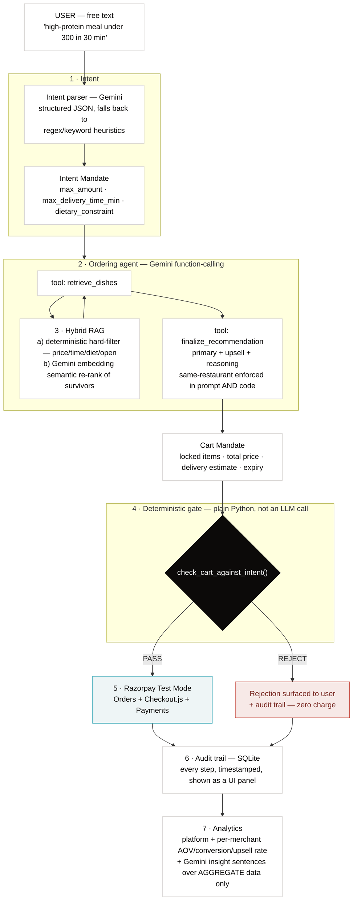
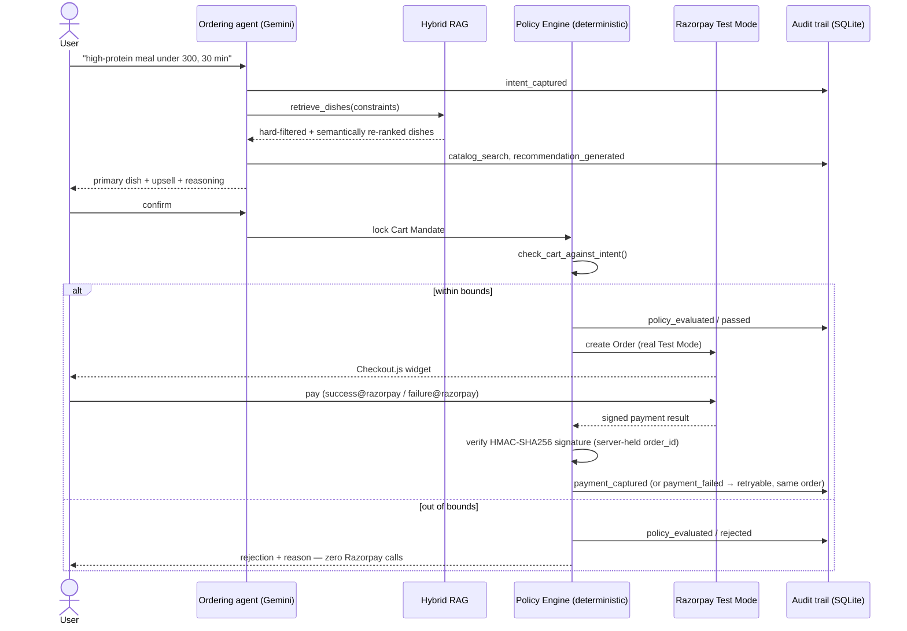
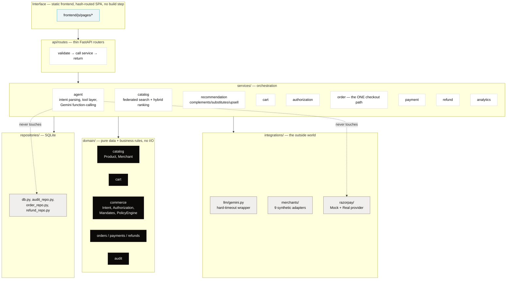

<div align="center">

# Aalok

**The deterministic gate between an AI agent's judgment and a merchant's money.**

Built for Razorpay's AI Buildathon — Track: **AI Growth & Agentic Commerce**

<br/>


[**Why now**](#-why-now) · [**The approach**](#-the-approach) · [**Trust model**](#-the-trust-model) · [**Architecture**](#-architecture) · [**Quick start**](#-quick-start) · [**API**](#-api-surface)

</div>

<br/>

> **Aalok is not Zomato, and it is not a production payments system.**
> It is a reference implementation of the boundary the buildathon's own bar describes —
> "every money action explainable, bounded and gated" — built against real Razorpay Test
> Mode APIs, not a simulation of one.

<br/>

## Table of contents

- [Why now](#-why-now)
- [What Aalok is](#-what-aalok-is)
- [Which example direction this covers](#-which-example-direction-this-covers)
- [The approach](#-the-approach)
- [The trust model](#-the-trust-model)
- [A single order, end to end](#-a-single-order-end-to-end)
- [Interface](#-interface)
- [Architecture](#-architecture)
- [Merchant adapters](#-merchant-adapters)
- [The Razorpay boundary](#-the-razorpay-boundary--whats-real-whats-test-mode-whats-mocked)
- [Repository structure](#-repository-structure)
- [Quick start](#-quick-start)
- [Configuration](#-configuration)
- [API surface](#-api-surface)
- [Testing](#-testing)
- [Known limitations](#-known-limitations)

<br/>

---

## ▸ Why now

The brief's own framing: **NPCI's UAP and the global protocol race (ACP, AP2, x402) make
agent-to-agent commerce the open problem of the year, and Razorpay's in-app pilots are
already live.** Concretely, four things are happening in the same window this project was
built in, and none of them are settled:

| Signal | What it is |
|---|---|
| **NPCI's Unified AI Protocol (UAP)** | India's rails-level attempt to let AI agents discover and transact with merchants over UPI — still emerging |
| **ACP** | OpenAI + Stripe's Agentic Commerce Protocol |
| **AP2** | Google's Agent Payments Protocol (Intent Mandate → Cart Mandate) |
| **x402** | Coinbase's HTTP-402-based agent payment scheme |
| **Razorpay's own in-app pilot with Zomato** | "a high-protein meal that can reach within 30 minutes" → agent curates → user confirms → payment completes instantly — the demo this project is modeled on, proving merchant-side demand is real *today* |

Four specs, one problem, no winner yet. A hackathon build that hard-commits to one wire
format bets against the field. Aalok's answer is to build the **pattern** every one of
these protocols shares — a bounded intent → a priced, lockable cart → a deterministic
allow/reject gate → a settled payment → an auditable record — using AP2's mandate
vocabulary as the concrete shape (it maps cleanly onto Razorpay's Orders API) **without**
adopting AP2's cryptographic signing layer or betting the project on it being the protocol
that wins. The same reasoning is why `/api/catalog/feed` is a plain schema.org/JSON-LD feed
rather than a bespoke format: it's the one representation any ACP/AP2/x402/UAP-style
discovery step — or a plain HTTP client like [`examples/ai_buyer.py`](examples/ai_buyer.py)
— can already parse without a Aalok-specific SDK.

<br/>

---

## ▸ What Aalok is

Aalok is a fictional multi-merchant commerce orchestrator — **not Zomato** — built
as a stand-in modeled directly on Razorpay's own publicly demoed pilot. We don't have
Zomato's catalog or brand rights, so Aalok is a separate identity styled in the spirit
of Zomato's public design system as a nod to the pilot it's modeled on.

> **Sept 2026 update:** the backend was refactored from a food-only build into a
> general-purpose, multi-merchant, multi-category AI-native commerce core — food is now
> one of 9 connected synthetic merchants across 8 categories, not the whole product. This
> README covers the current, unified system; **[ARCHITECTURE.md](./ARCHITECTURE.md)** is
> the deep module-by-module reference for anyone extending it.

The buildathon's actual bar isn't "call Razorpay's API" — it's stated explicitly:

> Every money action explainable, bounded and gated. Show the audit trail and one failure
> handled gracefully.

So the entire system is built around one non-negotiable principle: **the LLM never has a
direct path to money.** Every AI-driven decision (what to recommend, what to upsell) flows
through a deterministic, non-LLM gate before a Razorpay call is ever made, and every step —
success or failure — is written to a visible, structured audit trail.

<br/>

---

## ▸ Which example direction this covers

The brief lists four example directions. Aalok implements three of them for real, and
deliberately does not claim the fourth:

| Direction | Status | Where |
|---|---|---|
| **Conversational in-app checkout** | Implemented | The Gemini-driven chat/agent flow → cart → Commerce Policy Engine → real Razorpay Test Mode Checkout.js, including a real failure + retry path |
| **Agent-readable catalog** | Implemented | [`/api/catalog/feed`](backend/api/routes/catalog.py) — schema.org JSON-LD, every merchant with real metadata — plus [`examples/ai_buyer.py`](examples/ai_buyer.py), a standalone external client that discovers → selects → transacts via `/api/external/purchase`, through the **same** policy gate as the chat flow |
| **Upsell & cross-sell agent** | Implemented | `finalize_recommendation`'s primary + upsell selection with same-restaurant enforcement (prompt *and* code), generalized post-refactor into `services/recommendation` (`find_complements`/`find_substitutes`) across all 9 merchants |
| **Campaign orchestrator** | **Not implemented** | Out of scope for this build — no scheduled/multi-touch outbound campaign logic exists anywhere in this repo. Listed here for honesty rather than left silently unaddressed |

<br/>

---

## ▸ The approach



**Why hybrid RAG, not pure semantic search.** Recent research (MACS, ComboShoppingBench)
specifically flags that LLMs and embeddings are unreliable at hard numeric constraints like
budget ceilings and time limits. So retrieval here is hybrid: `rag.py`/`ranking.py`
hard-filters on price/time/diet/open-status in plain code first, and only *then* uses Gemini
embeddings to semantically re-rank the survivors against the free-text craving. The LLM
never gets to "reason its way past" a hard constraint during retrieval — the same principle
that governs the payment gate.

**Why the agent is tool-using, not a single prompt.** The ordering agent is a genuine
Gemini function-calling loop: the model is handed `retrieve_dishes` and must call it (never
allowed to invent dishes), then must call `finalize_recommendation` as a forced
structured-output step. Every tool call is recorded in a trace that flows into the audit
trail — a reviewer can see not just what the agent recommended, but what it searched for and
considered along the way.

**Graceful degradation without a network / API key.** Every Gemini call in this codebase is
wrapped in a hard timeout (`integrations/llm/gemini.py`) and falls back to a deterministic
heuristic path: regex-based intent parsing, price-sorted retrieval, rule-based upsell
selection, templated analytics insights. This was not theoretical — this project's own
sandbox blocked the Gemini API during parts of development, and the fallback path is what
let the whole system be built, tested, and demoed end-to-end without it. Set
`GEMINI_API_KEY` on a machine with normal outbound HTTPS access and the real LLM-driven path
runs instead — nothing else needs to change.

<br/>

---

## ▸ The trust model

The bar, decomposed into invariants that are enforced in code, not policy:

| Invariant | Guarantee | Mechanism |
|---|---|---|
| **Explainable** | Every recommendation and every gate decision ships a reason a human can read before money moves | `primary_reasoning`/`upsell_reasoning` shown pre-payment; every backend step calls `audit.log_event(...)`; `policy_decision` carries a per-check breakdown, not a pass/fail bit |
| **Bounded** | A ceiling exists even if the user never states one | `domain/commerce/mandates.py::IntentMandate` (spend/time/diet ceilings) created once per session; `DEFAULT_MAX_AMOUNT`/`DEFAULT_MAX_DELIVERY_MIN` apply regardless of user input |
| **Gated** | The LLM proposes; it never disposes | `domain/commerce/policy.py::PolicyEngine.evaluate_cart` — deterministic, zero LLM calls — runs immediately before Razorpay order creation, shared by Aalok's own agent **and** external AI buyers. A failing gate makes **zero** Razorpay calls (`POST /api/demo/policy-rejection` proves it on demand) |
| **Audited** | Every step, success or failure, is a first-class UI panel, not a console log | `/api/audit`, rendered with status chips + per-check breakdowns on every chat turn and order confirmation |
| **One failure handled gracefully** | A declined payment doesn't corrupt state or duplicate a charge | `POST /api/order/confirm {force_fail: true}` simulates a decline; the same cart reuses the same Razorpay Order on retry (`orders_by_cart_key`), never creating a duplicate; both the failure and the recovery are written to the audit trail |
| **Defense in depth** | An LLM's compliance with a prompt is not a security boundary | Same-restaurant upsell and spend/time/diet bounds are asked for in the prompt **and** independently re-verified in code after the model responds — the code check is what actually holds if the model doesn't comply |
| **No silent degradation** | A misconfiguration fails loudly, not quietly | `PAYMENT_PROVIDER=razorpay_test` with missing keys raises `PaymentProviderMisconfigured` at call time — it never silently drops to mock mode mid-demo |

<br/>

---

## ▸ A single order, end to end



<br/>

---

## ▸ Interface

A single-page dashboard (`frontend/`) with client-side hash routing — no build step, no
framework. A badge next to the logo always shows the active payment mode
(`RAZORPAY TEST MODE` / `MOCK MODE`), so a demo is never ambiguous about what it's running.

| Route | Purpose |
|---|---|
| `#/overview` | Landing snapshot — key metrics at a glance |
| `#/agent` | The conversational ordering agent — chat, cart, confirm & pay |
| `#/discover` | Federated catalog search across all 9 merchants |
| `#/merchants` | Connected merchants and their capabilities |
| `#/orders` | Order history and status |
| `#/payments` | Payment records and refunds |
| `#/analytics` | Platform + per-merchant AOV, conversion, upsell rate, agentic funnel, growth experiment |
| `#/audit` | The audit trail — every logged event, as a first-class panel |
| `#/settings` | Runtime configuration surface |

<br/>

---

## ▸ Architecture



One FastAPI process, organized by domain boundary, not by microservice — no Kubernetes, no
Kafka/Redis/Postgres/vector DB. SQLite + a modular monolith is sufficient for this prototype.

**AI tool boundary.** `services/agent/tools.py` is the *entire* surface the LLM is ever
handed: `search_catalog, get_product, compare_products, check_availability,
get_delivery_estimate, find_complements, find_substitutes, create_cart, modify_cart,
get_cart, get_order_status`. The LLM structurally **cannot** reach
`create_razorpay_order`, `capture_payment`, `refund_payment`, `verify_payment`, the webhook
secret, or DB credentials — those symbols don't exist in the tools module
(`tests/test_ai_tool_boundary.py` asserts this directly, both via the declared tool list and
via module-namespace inspection).

**Idempotency.** `Cart.version` increments on every mutation; `OrderService` keys a pending
order by `checkout:{cart_id}:{cart_version}`. A retry after a failed payment reuses the
existing order instead of creating a second one; a retry against an already-captured order
short-circuits before Authorization/Policy even run.

Full module-by-module reference, including the two-stage Authorization vs. Commerce Policy
Engine split, the Unified Commerce Schema, and every request-lifecycle state machine: see
**[ARCHITECTURE.md](./ARCHITECTURE.md)**.

<br/>

---

## ▸ Merchant adapters

Every merchant is explicitly synthetic and fictional — no real Swiggy/Zomato/BigBasket/
Zepto/BlueStone/PVR/Vi API or data is used anywhere in this project.

| Merchant | Category | Products | Notes |
|---|---|---|---|
| 8 restaurants (`food_adapter.py`) | food | ~35 dishes | the project's original, already-sourced food catalog — one adapter instance per restaurant |
| FreshKart | grocery | 10 | synthetic, BigBasket-style |
| ZipMart | grocery (quick-commerce) | 8 | synthetic, Zepto-style, sub-15-min delivery |
| Threadloom | fashion | 9 | synthetic |
| GlowNest | beauty | 8 | synthetic, Honasa-style |
| CircuitBay | electronics | 8 | synthetic |
| Aurelia | jewellery | 8 | synthetic, BlueStone-style |
| CineHall | entertainment | 8 | synthetic, PVR-style (tickets + concessions) |
| ConnectPlus | services | 8 | synthetic, Vi-style (recharge/broadband/DTH) |

Each adapter ships raw seed data in that merchant's own field-naming convention and a
`_normalize()` step that turns it into the Unified `Product` schema — a genuine
normalization pass, not a schema pass-through. Adding a real merchant later means
implementing `MerchantAdapter`'s four methods against the real API and registering the
instance — nothing else in the codebase changes.

<br/>

---

## ▸ The Razorpay boundary — what's real, what's Test Mode, what's mocked

The payment path uses REAL Razorpay Checkout.js + signature verification when
`PAYMENT_PROVIDER=razorpay_test` is configured — nothing about the outcome is simulated in
that mode:

```
cart locked
  → Commerce Policy Engine (check_cart_against_intent) → PASS
  → backend creates exactly ONE Razorpay Order (real POST /v1/orders)
  → frontend opens Razorpay Checkout.js with that order_id
  → user completes payment in the real Test Mode widget (UPI: success@razorpay / failure@razorpay)
  → Checkout returns {razorpay_payment_id, razorpay_order_id, razorpay_signature}
  → backend verifies HMAC-SHA256(order_id + "|" + payment_id, key_secret)
       — using THIS SERVER'S OWN stored order_id, never the one in the request body
  → only a verified signature marks payment_captured
  → the webhook (if configured) independently confirms/updates the same state, idempotently
```

| Aalok concept | Razorpay object/API | Status |
|---|---|---|
| Internal order | Orders API (`POST /v1/orders`) | **Implemented** — real REST call in Test Mode |
| Checkout | Standard Checkout (Checkout.js) | **Implemented** — real widget, unmodified flow |
| Payment capture/state | Payments API (`fetch_payment`) | **Implemented** |
| Signature verification | `HMAC-SHA256(order_id\|payment_id, key_secret)` | **Implemented** — Razorpay's documented algorithm |
| Webhook | `X-Razorpay-Signature` + `X-Razorpay-Event-Id` dedupe | **Implemented** |
| Refunds | `POST /v1/payments/{id}/refund` | **Implemented** (mock + real-REST-shape test mode) |
| Mock mode | n/a | **Implemented** — every response tagged `"mode": "mock"`, exercises the full flow with zero network calls |
| UPI Reserve Pay / Agentic Payments on LLMs | Razorpay's live "coming soon" / partner-only products | **Not implemented / not claimed** — no self-serve API reference is publicly available; Aalok's own deterministic Authorization + Policy engine is what actually enforces spending bounds today |
| Razorpay MCP Server, Agent Studio | merchant back-office automation | **Architectural extension points only** — real Razorpay products solving a different (merchant back-office, not consumer-checkout) problem; not integrated |

Two separate demos, not to be confused (see `main.py` docstrings):

- **Demo A — policy rejection** (`POST /api/demo/policy-rejection`): an invalid cart is
  REJECTED by the Commerce Policy Engine before any Razorpay call. `razorpay_called` is
  always `false`, in every payment mode.
- **Demo B — payment failure → retry → success**: a normal `Confirm & Pay` in real Test
  Mode. Use UPI `failure@razorpay` to trigger a real decline (order stays pending,
  retryable), then `Confirm & Pay` again with `success@razorpay` to complete it. Both
  attempts use the exact same Razorpay Order — see the audit trail's `order_reused` event.

Without `RAZORPAY_WEBHOOK_SECRET` set, `/api/webhook/razorpay` refuses to process anything
(HTTP 501) — it never silently accepts an unverified delivery, local or live.

<br/>

---

## ▸ Repository structure

```
aalok/
├─ backend/
│  ├─ main.py               app factory: routers, startup, static mount
│  ├─ core/                 config.py, errors.py
│  ├─ domain/                pure data + business rules — no I/O
│  │  ├─ catalog/              Product (unified schema), Merchant, Capabilities
│  │  ├─ cart/                  Cart, CartItem, CartStatus
│  │  ├─ commerce/               Intent, Authorization, Mandates, PolicyEngine
│  │  ├─ orders/ payments/ refunds/  state + status enums
│  │  └─ audit/                    named audit event-type constants
│  ├─ services/               orchestration
│  │  ├─ agent/                 intent parsing, AI tool layer, Gemini function-calling loop
│  │  ├─ catalog/                 federated search (gateway.py) + hybrid ranking (ranking.py)
│  │  ├─ recommendation/            complements/substitutes/upsell
│  │  ├─ cart/ authorization/ order/ payment/ refund/  one service each
│  │  ├─ analytics/                    platform/merchant analytics + agentic funnel
│  │  └─ session/                        server-side session state
│  ├─ integrations/           talks to the outside world
│  │  ├─ llm/gemini.py          hard-timeout wrapper around the Gemini SDK
│  │  ├─ merchants/               9 synthetic adapters + registry
│  │  └─ razorpay/                  Mock + Real provider, MCP extension point
│  ├─ repositories/           SQLite persistence
│  └─ api/routes/              thin FastAPI routers
├─ frontend/
│  ├─ index.html               single-page shell, hash-routed
│  ├─ js/pages/                 overview, agent, discover, merchants, orders,
│  │                             payments, analytics, audit, settings
│  ├─ js/components/            statCard, table, chart, timeline, cartDrawer, …
│  └─ css/                      tokens.css design system (Zomato-derived palette/type)
├─ tests/                     99 tests: policy/authorization engine, cart service,
│                              catalog gateway, payment safety, real Razorpay
│                              integration, refunds, AI tool boundary, security
│                              boundary, external AI buyer, growth experiment
├─ experiments/
│  └─ growth_experiment.py    synthetic baseline-vs-AI-agent benchmark
├─ examples/
│  └─ ai_buyer.py              standalone external AI buyer reference client
├─ requirements.txt
├─ .env.example
├─ ARCHITECTURE.md            deep module-by-module reference — start there to extend
└─ README.md                  this file
```

<br/>

---

## ▸ Quick start

```bash
cd aalok
pip install -r requirements.txt          # add --break-system-packages if needed
cp .env.example .env
```

Edit `.env`: set `GEMINI_API_KEY` for the real LLM path (free at
[aistudio.google.com/apikey](https://aistudio.google.com/apikey)) — everything falls back to
deterministic heuristics if it's unset. `RAZORPAY_KEY_ID`/`RAZORPAY_KEY_SECRET` are optional.

```bash
python3 -m uvicorn backend.main:app --reload --port 8000
```

Open `http://localhost:8000/` for the ordering agent and the rest of the dashboard. The
badge next to the logo always shows the active payment mode.

<details>
<summary><b>Run the test suite, growth experiment, and demos</b></summary>

<br/>

```bash
python3 -m pytest tests/ -v                 # 99 tests
python3 experiments/growth_experiment.py    # baseline vs. AI-agent simulation, standalone
python3 examples/ai_buyer.py --requirement "high-protein meal under 300"   # needs the server running
curl -X POST http://localhost:8000/api/demo/policy-rejection               # guaranteed REJECT
```

</details>

<details>
<summary><b>Manual Razorpay Test Mode walkthrough</b></summary>

<br/>

1. Get test keys (prefixed `rzp_test_`) from Razorpay Dashboard → Settings → API Keys.
   Set in `.env`:
   ```
   RAZORPAY_KEY_ID=rzp_test_xxxxxxxx
   RAZORPAY_KEY_SECRET=xxxxxxxxxxxxxxxx
   PAYMENT_PROVIDER=razorpay_test
   ```
2. Restart the server. The badge must read **RAZORPAY TEST MODE** (green). If keys are
   blank/wrong with `PAYMENT_PROVIDER=razorpay_test` set, every order attempt fails loudly
   with `Razorpay API call failed: ...` — it never silently drops to mock mode.
3. Order something, click **Confirm & Pay** — opens the real Checkout.js window.
4. Pay with UPI `failure@razorpay` — Checkout reports a decline; the app shows PAYMENT
   FAILED / retryable / same Order.
5. Click **Confirm & Pay** again — the audit trail's `order_reused` event proves it's the
   same Razorpay Order, not a new one.
6. Pay again with UPI `success@razorpay` — Checkout succeeds, the backend verifies the
   signature, `payment_captured` appears with `signature_verified: true`.

</details>

<details>
<summary><b>Webhook configuration</b></summary>

<br/>

**Local, no public URL needed** — `tests/test_razorpay_integration.py` signs a payload with
a test secret exactly the way Razorpay does and posts it to `/api/webhook/razorpay`
in-process, proving the signature-verification and idempotency code is correct:
```bash
python3 -m pytest tests/test_razorpay_integration.py -v
```
This does **not** prove Razorpay's real infrastructure can reach your machine — for that you
need a live tunnel.

**Live, Test Mode webhook** — this repo does not hard-code or install a tunnel:
1. Run one yourself, e.g. `ngrok http 8000` — copy the public `https://...` URL.
2. Razorpay Dashboard (Test Mode) → Settings → Webhooks → + Add New Webhook:
   - **Webhook URL**: `https://<your-tunnel-domain>/api/webhook/razorpay`
   - **Secret**: any string — paste the same value into `.env` as `RAZORPAY_WEBHOOK_SECRET`
   - **Active events**: `payment.captured`, `payment.failed`, `order.paid`
3. Save. Razorpay sends a test ping — check the server console and `/api/audit` for a
   `webhook_received` event.

</details>

<br/>

---

## ▸ Configuration

Every setting is read from `.env` (see [`.env.example`](.env.example)):

| Variable | Purpose | Default |
|---|---|---|
| `LLM_PROVIDER` | Only `gemini` is implemented; anything else forces the deterministic fallback everywhere | `gemini` |
| `LLM_API_KEY` / `GEMINI_API_KEY` | Enables the real agent + embeddings path | *(unset → heuristic fallback)* |
| `RAZORPAY_KEY_ID` / `RAZORPAY_KEY_SECRET` | Real Razorpay Test Mode credentials | *(unset → mock mode)* |
| `RAZORPAY_WEBHOOK_SECRET` | Required for `/api/webhook/razorpay` to accept anything | *(unset → 501)* |
| `PAYMENT_PROVIDER` | `razorpay_test` (fails loudly if keys missing) · `mock` (force offline) · unset (infer from keys) | *(unset)* |
| `DATABASE_URL` | SQLite only — no Postgres/Redis/Kafka/vector DB used | `sqlite:///./backend/aalok.db` |

<br/>

---

## ▸ API surface

**33 REST endpoints**, grouped by concern.

<details>
<summary><b>Endpoint reference</b> (click to expand)</summary>

<br/>

| Area | Endpoints |
|---|---|
| **Agent (unified)** | `POST /api/agent/chat` |
| **Legacy chat (food-only, pre-refactor)** | `POST /api/chat` · `POST /api/order/quick-add` |
| **Catalog & discovery** | `GET /api/catalog` · `GET /api/catalog/feed` · `GET /api/catalog/search` · `GET /api/catalog/products/{id}` · `GET /api/catalog/{id}/complements` · `GET /api/catalog/{id}/substitutes` · `GET /api/merchants` · `GET /api/growth/experiment` |
| **Cart** | `POST /api/cart` · `GET /api/cart/{cart_id}` · `POST /api/cart/{cart_id}/items` · `DELETE /api/cart/{cart_id}/items/{item_id}` |
| **Orders & checkout** | `POST /api/order/confirm` · `POST /api/external/purchase` · `POST /api/demo/policy-rejection` · `GET /api/orders` · `GET /api/orders/{id}` · `POST /api/checkout/validate` · `POST /api/orders` |
| **Payments & refunds** | `GET /api/payment-mode` · `POST /api/order/verify-payment` · `POST /api/order/payment-failed` · `POST /api/payments/create` · `GET /api/payments/{id}` · `POST /api/payments/{internal_order_id}/refund` · `GET /api/payments/refunds` · `GET /api/payments/refunds/{id}` |
| **Webhooks** | `POST /api/webhook/razorpay` · `POST /api/webhooks/razorpay` |
| **Analytics & audit** | `GET /api/analytics` · `GET /api/audit` |

</details>

```bash
# The external-AI-buyer path — same policy gate as the chat agent, no bypass
curl -X POST http://localhost:8000/api/external/purchase \
  -H "Content-Type: application/json" \
  -d '{"requirement": "high-protein meal under 300, delivered within 30 minutes"}'
```

<br/>

---

## ▸ Testing

```
pytest tests/ -v   →   99 passed
```

| File | Covers |
|---|---|
| `test_mandates.py` | Intent/Cart mandates, the Commerce Policy Engine's per-check breakdown |
| `test_authorization.py` | Mandate validity, expiry, revocation, scope |
| `test_cart_service.py` | Cart lifecycle, cross-merchant mismatch rejection |
| `test_catalog_gateway.py` | Federated search, one merchant failing doesn't break the rest |
| `test_payment_safety.py` | Retry reuses the same Razorpay order; a captured order short-circuits |
| `test_razorpay_integration.py` | Signature verification, webhook idempotency, order-creation shape |
| `test_refund.py` | Refund idempotency — a duplicate request is rejected, not duplicated |
| `test_ai_tool_boundary.py` | The LLM's tool surface structurally cannot reach payment/DB symbols |
| `test_security_boundary.py` | A client-supplied amount can never reach Razorpay |
| `test_ai_buyer.py` | The external buyer path uses the *same code*, not just the same logic, as the chat agent |
| `test_growth_experiment.py` | The synthetic baseline-vs-agent benchmark is deterministic and seeded |
| `test_dashboard_reads.py` | Analytics/audit read paths |

<br/>

---

## ▸ Known limitations

Genuine, not additional feature ideas:

- **In-memory session/cart/order state** (`services/session`, `services/cart`,
  `services/order`) — fine for a single-process prototype; production would move this to
  Redis/a DB keyed by authenticated session.
- **The Gemini function-calling agent loop** was not exercised against a live Gemini API in
  every environment this was built in — every code path degrades to the deterministic
  fallback and is exercised that way by the test suite. On a machine with normal outbound
  HTTPS access and a real key, the LLM-driven path runs unchanged.
- **No-LLM fallback recommendation quality** is a hard-filter + price-sort — it finds a
  constraint-satisfying item, not necessarily the *most relevant* one.
- **`RefundService` has no UI** — API + tests only.
- **Live Checkout.js round-trip** was exercised via the server-side contract
  (`tests/test_razorpay_integration.py`, monkeypatched HTTP layer, HMAC computation matching
  Razorpay's documented formula) rather than against a live account with real test keys in
  every build environment — the manual walkthrough above is exactly what completes that last
  mile with real keys.
- **Campaign orchestrator** (one of the brief's four example directions) is not implemented
  — see [Which example direction this covers](#-which-example-direction-this-covers).

<br/>

### A note on the API key that was shared during development

The `GEMINI_API_KEY` used during development was pasted directly into a chat session.
**Rotate/regenerate it in Google AI Studio before making this repository public** — the
buildathon requires a public repo, and a key visible in git history or a committed `.env`
file is a leaked credential regardless of where it originated. `.env` is already gitignored
— double-check it never gets committed.
