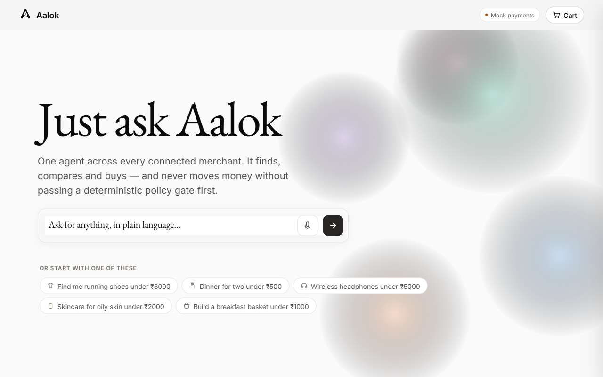
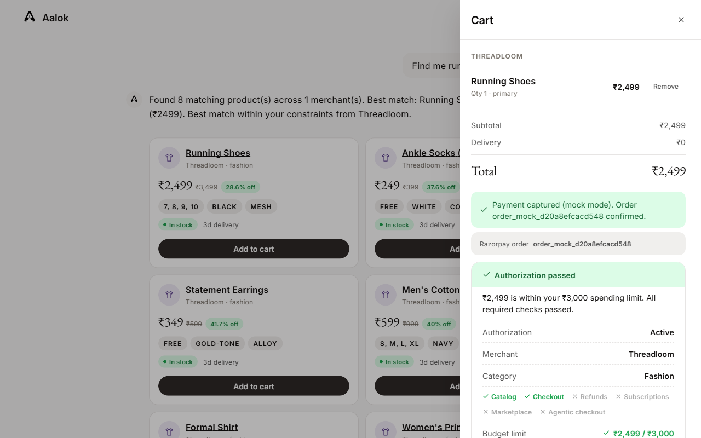
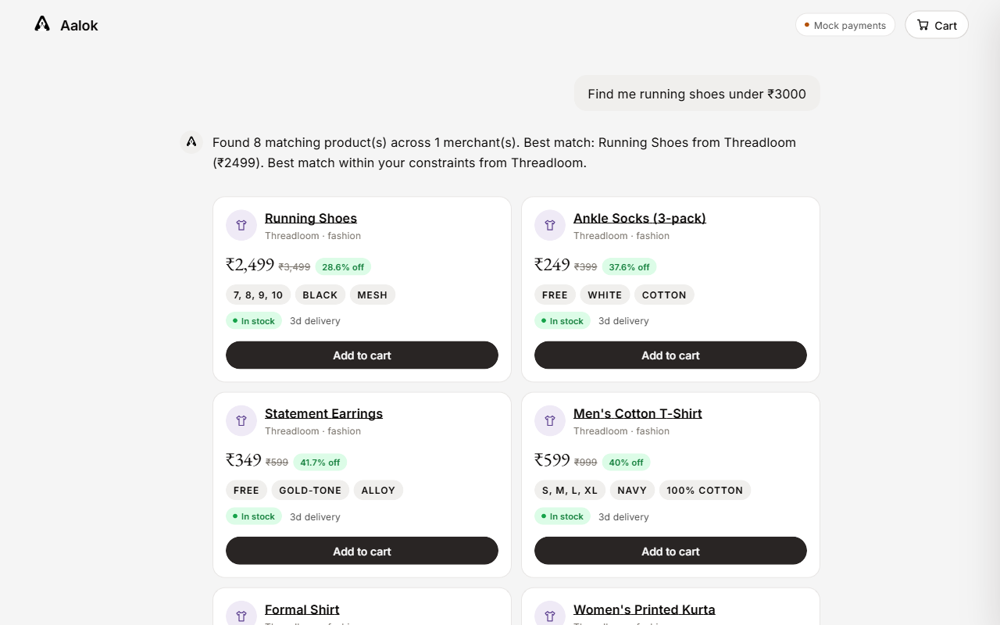
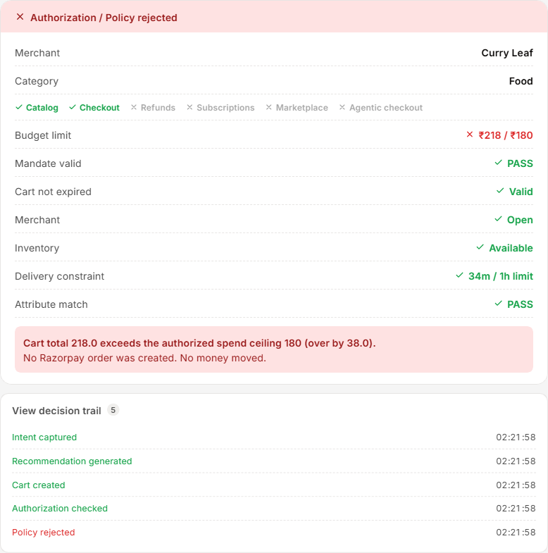
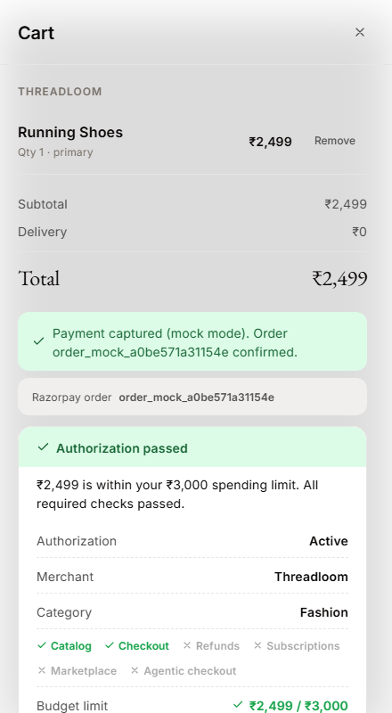
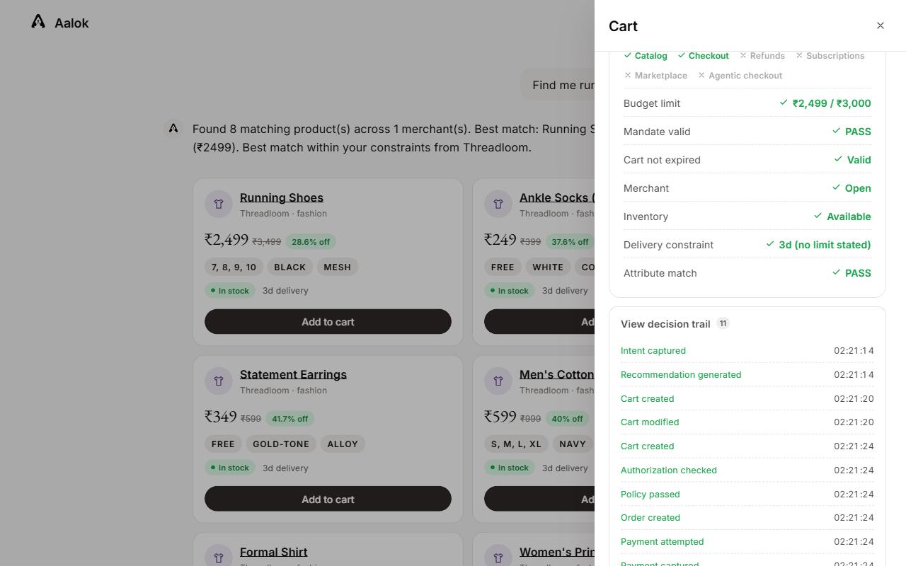
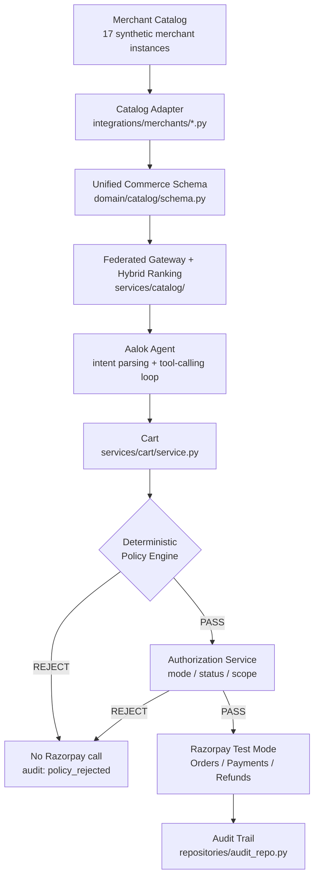
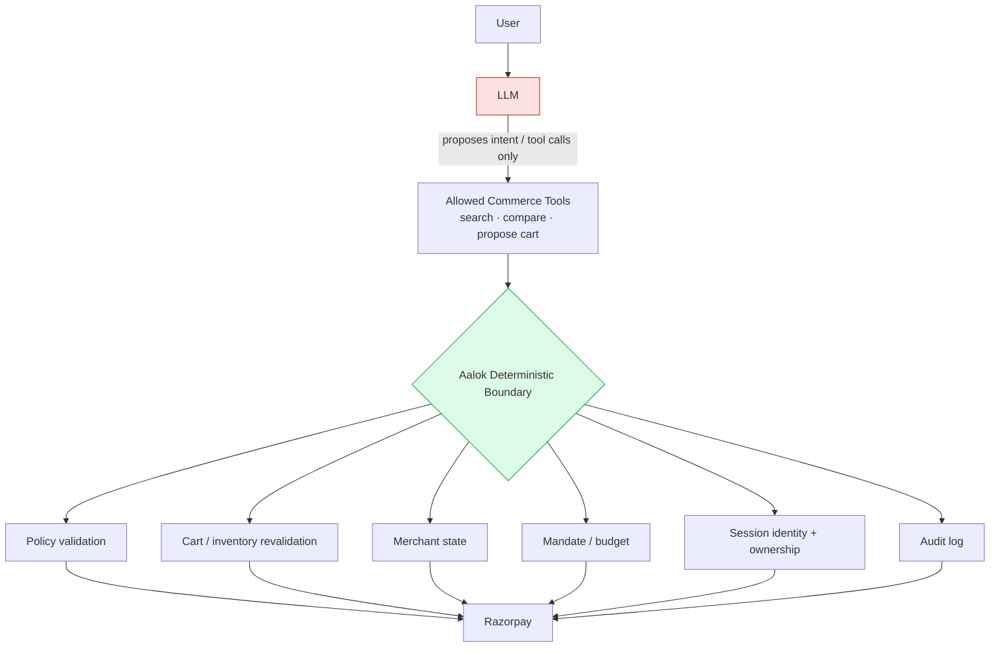

<div align="center">
  

  # Aalok
  ### The Trust Layer for Agentic Commerce

  Built for Razorpay's AI Buildathon — Track 01: **AI Growth & Agentic Commerce**

  
  
  
  
  
  
  
</div>

<br/>

## Aalok is the trust layer that lets AI buyers safely transact with merchants.

**AI proposes. Aalok authorizes. Razorpay executes.**

That's the whole pitch. Everything below is proof, not decoration: every diagram links to the
file that implements it, every number links to the test that asserts it, and nothing in this
document claims more than the code actually does.

<p align="center">
  
  
</p>

<br/>

## Table of contents

| | |
|---|---|
| [The problem](#-the-problem) | [Security Model](#-security-model) |
| [The solution](#-the-solution) | [Razorpay integration](#-razorpay-integration) |
| [60-second demo](#-60-second-demo) | [External AI Buyer](#-external-ai-buyer) |
| [Why this fits Track 01](#-why-this-fits-track-01) | [Merchant adapters](#-merchant-adapters) |
| [Architecture](#-architecture) | [Growth layer: contextual upsell](#-growth-layer-contextual-upsell) |
| [Demo Control Panel](#-demo-control-panel) | [Testing](#-testing) |
| [How to run](#-how-to-run) | [Limitations](#-limitations) |
| [Repository structure](#-repository-structure) | [Future protocol compatibility](#-future-protocol-compatibility) |

<br/>

---

## ▸ The problem

AI can already discover products — search, compare, summarize, recommend. That part of
agentic commerce is close to solved. The harder problem, and the one that actually blocks
autonomous agents from touching real money, is different:

**How do you let an autonomous agent initiate a financial action while preserving
authorization, bounded spending, explainability, and auditability?**

An agent that can *propose* a purchase is a chatbot with good taste. An agent that can *cause*
a purchase — safely, boundedly, explainably, for a merchant who never has to trust the agent
itself — is a different and much harder system. That system is what Aalok is.

<br/>

---

## ▸ The solution

```
   AI proposes  →  Aalok authorizes  →  Razorpay executes
```

A shopper (or an external AI buyer) states an intent in plain language —
*"find me black running shoes under ₹3,000"* — and one agent searches every connected
merchant, compares across them, explains its pick, builds a cart, and takes the payment.

The thing that makes this more than a chat wrapper is what sits between the agent's
recommendation and the merchant's money: a **deterministic Commerce Policy Engine**
(`domain/commerce/policy.py`) that re-derives every fact from the server and either passes or
rejects the cart in plain Python — no model in that decision at all, ever. The LLM proposes.
It never authorizes. That boundary is enforced structurally (see
[Security Model](#-security-model)), not by prompting the model to behave.

<br/>

---

## ▸ 60-second demo

The exact flow a judge can reproduce, live, in under a minute (also wired into the
[Demo Control Panel](#-demo-control-panel) as one click each):

1. **Ask** — *"Find me black running shoes under ₹3,000"*. Aalok searches every connected
   merchant and recommends Running Shoes (Threadloom, ₹2,499), with a reason.
2. **Authorize** — add to cart, checkout. The receipt shows every check —
   Budget ✓ · Inventory ✓ · Merchant ✓ · Delivery ✓ · Cart integrity ✓ — computed server-side,
   never guessed by the UI.
3. **Pay** — Razorpay Test Mode (or mock mode, clearly labeled either way) captures the
   payment. **`PAYMENT CAPTURED`**, with the real Razorpay order id.
4. **Break it, on purpose** — change the budget to ₹1,000 and try again.
   **`PURCHASE BLOCKED — ₹2,499 > ₹1,000 — Razorpay called: NO — Money moved: NO.`**
5. **Tamper with it** — the Demo Control Panel's *Cart Tampering* scenario submits a cart with
   a forged, lower price. The server independently re-fetches the true catalog price before the
   policy engine ever sees the cart. **`CART VALIDATION FAILED — Purchase blocked.`**
6. **Fail, then recover** — *Payment Failure* simulates a declined Test Mode payment. The order
   is preserved, not duplicated. *Payment Retry* completes it — **with the identical Razorpay
   order id**, proving idempotency.
7. **Open the audit trail** — every step above, timestamped, in one expandable record.
8. **Switch actors** — the *External AI Buyer* scenario runs the same purchase through a
   completely different, unaffiliated caller. It reaches the exact same authorization boundary.
   No privileged path exists for it to skip.

Nothing above is scripted with fake data — every number, order id, and rejection reason comes
from the real backend pipeline running live.

<p align="center">
  
  
  
</p>
<p align="center"></p>

<br/>

---

## ▸ Why this fits Track 01

Track 01's brief: *"Grow the merchant's revenue, and make them sellable to AI buyers... Build
an agent that grows revenue for a merchant on Razorpay test-mode APIs, or that makes a
merchant transactable by an AI buyer end to end... Every money action explainable, bounded and
gated. Show the audit trail and one failure handled gracefully."*

Aalok takes the harder path: **making a merchant transactable by an AI buyer, end to end** —
and adds a small, honest growth layer on top.

| Track 01 ask | Where Aalok answers it |
|---|---|
| AI-readable catalog | `domain/catalog/schema.py`'s Unified Commerce Schema — [Merchant adapters](#-merchant-adapters) |
| External AI buyer, end to end | `POST /api/external/purchase`, no privileged path — [External AI Buyer](#-external-ai-buyer) |
| Conversational commerce | The natural-language chat/agent flow — [60-second demo](#-60-second-demo) |
| Bounded / gated money actions | The deterministic Policy + Authorization gate — [Security Model](#-security-model) |
| Audit trail | 27 named event types, every checkout response carries it — [Security Model](#-security-model) |
| Graceful failure | Payment-failure + idempotent retry, cart tampering rejection — [60-second demo](#-60-second-demo) |
| Razorpay Test Mode | Real Orders/Payments API, real signature verification — [Razorpay integration](#-razorpay-integration) |
| Revenue / growth | Merchant-grounded upsell, never invented — [Growth layer](#-growth-layer-contextual-upsell) |

The current demo's merchant data is **synthetic** — 17 seeded merchant instances across 8
categories, no live Swiggy/Zomato/BigBasket/Zepto integration anywhere in the codebase. What's
real is the *pipeline*: every adapter is normalized into one shared schema, searched through
one federated gateway, and transacted through one policy-gated checkout — the same pipeline a
real merchant integration would sit behind. See [Merchant adapters](#-merchant-adapters).

Revenue/conversion framing is deliberately modest: natural-language discovery collapsing
search + compare + cart into one turn, and a payment gate that fails fast with a specific
reason instead of a silent decline, are the kind of friction reductions that plausibly help
conversion. **This is not a measured claim.** `experiments/growth_experiment.py` ships a
labeled synthetic benchmark comparing a baseline flow against an agent flow — its own module
docstring calls it *"a synthetic benchmark, not measured merchant performance."* No revenue
uplift has been measured against a real merchant.

<br/>

---

## ▸ Architecture

A modular monolith. Dependencies point strictly inward — `domain/` imports nothing from
`services/`, `services/` imports nothing from `api/`.



The protocol-level view — the same shape whether the caller is Aalok's own agent, a browser
tab, or an unaffiliated third-party AI buyer:

```
AI Buyer  →  Commerce Intent  →  Merchant Catalog  →  Purchase Mandate  →  Authorization  →  Payment Provider
```

Aalok is the **policy-enforcement point** in that chain, regardless of what transports the
intent or the payment request — see [Future protocol compatibility](#-future-protocol-compatibility)
for why that separation matters beyond this hackathon.

<br/>

---

## ▸ Demo Control Panel

A **Demo** button in the header opens a panel of one-click, deterministic scenarios for live
presentation — every button calls a **real** backend endpoint through the exact same
`OrderService.checkout()` pipeline as the conversational UI. The panel only chooses which real
inputs to send; it does not bypass, mock, or shortcut authorization, policy, or payment in any
way. See `frontend/js/components/demoPanel.js` and the small number of dedicated
`/api/demo/*` routes it calls (`backend/api/routes/orders.py`).

| Button | What it proves |
|---|---|
| Successful Purchase | The golden path — authorization passes, Razorpay is called, payment captures |
| Budget Rejection | Over-budget cart rejected before any Razorpay call |
| Cart Tampering | A forged, lower price never reaches the policy engine — the server re-derives the true price first |
| Expired Authorization | A well-within-budget cart is still blocked once its authorization window has closed |
| Unauthorized Session | A second, independent identity is blocked from reading the first session's cart — the exact `check_ownership()` path every cart route runs |
| Inventory Change | An item that's gone out of stock fails the policy engine's inventory check, even though budget passes |
| Duplicate Payment | Checking out an already-captured cart a second time makes **zero** new Razorpay calls — idempotency, not a fresh charge |
| Payment Failure | A declined Test Mode payment leaves the order pending, not duplicated |
| Payment Retry | The retry reuses the **identical** Razorpay order id |
| External AI Buyer | A completely separate, self-minted identity reaches the exact same authorization boundary |
| Upsell Accepted / Declined | Both branches of a merchant-grounded upsell offer, both audited |

Every result renders the real `authorization_decision`/`decision`/`audit_trail` fields the
backend returns — nothing paraphrased — plus an explicit, unmissable **`RAZORPAY CALLED`** /
**`MONEY MOVED`** banner (`authorizationCard.js::moneyBanner`), because that distinction is the
entire point of the architecture. The same banner and the same "PURCHASE AUTHORIZED" /
"PURCHASE BLOCKED" hero card render everywhere a checkout outcome appears — the cart drawer, the
conversation's upsell flow, and this panel — not just in the demo.

<br/>

---

## ▸ How to run

```bash
pip install -r requirements.txt
cp .env.example .env
```

`LLM_API_KEY`/`GEMINI_API_KEY` and the Razorpay keys are all optional — the product runs fully
offline without any of them, in mock payment mode with deterministic heuristic intent parsing.

```bash
python -m uvicorn backend.main:app --reload --port 8000
```

Open **http://localhost:8000** — that is the whole app; there are no other pages.

```bash
python -m pytest tests/ -v            # 145 tests
python experiments/intent_eval.py     # 10-query heuristic check
python examples/ai_buyer.py           # standalone external AI buyer client
```

**Configuration:**

| Variable | Default | Effect |
|---|---|---|
| `LLM_API_KEY` (or `GEMINI_API_KEY`) | unset | Enables the real Gemini path — intent parsing, tool-calling, semantic re-rank. Unset ⇒ deterministic keyword/regex fallback. Everything still works. |
| `SESSION_SECRET` | unset (ephemeral, per-process) | Signs session tokens (`services/session/auth.py`). Set it for tokens to survive a server restart; otherwise a restart invalidates existing browser sessions safely (they re-mint automatically). |
| `PAYMENT_PROVIDER` | infer from keys | `razorpay_test` switches to the real Test Mode API and fails loudly if keys are missing — never silently degrades to mock. `mock` forces offline mode even if keys are present. |
| `RAZORPAY_KEY_ID` / `RAZORPAY_KEY_SECRET` | unset | Test Mode credentials (`rzp_test_*`). Required when `PAYMENT_PROVIDER=razorpay_test`. |
| `RAZORPAY_WEBHOOK_SECRET` | unset | Required for webhook signature verification; the webhook route returns `501` without it. |
| `DATABASE_URL` | `sqlite:///./backend/aalok.db` | Delete the file to reset analytics/audit state. |

See [Razorpay integration](#-razorpay-integration) for the full mock-vs-test-mode walkthrough.

<br/>

---

## ▸ Security Model

This is the load-bearing section. Read this if you read nothing else.

### What the LLM can do

- Discover products (`search_catalog`, `get_product`, `compare_products`, `check_availability`,
  `get_delivery_estimate`, `find_complements`, `find_substitutes`)
- Recommend a product, with a short, user-safe reasoning string
- Propose a cart (`create_cart`, `modify_cart` — propose only, see below)
- Request that Aalok take an action on the user's behalf

### What the LLM cannot do

- Directly call Razorpay
- Authorize a payment
- Alter the user's spending limit
- Bypass cart validation
- Bypass policy
- Access another user's session, cart, or order



The LLM cannot cross into the green box directly. `services/agent/tools.py` is the **entire
surface** the LLM is ever handed:

```
search_catalog · get_product · compare_products · check_availability
get_delivery_estimate · find_complements · find_substitutes
create_cart · modify_cart · get_cart · get_order_status
```

The module does not import or reference a Razorpay client, a payment provider, a webhook
secret, a database credential, or any policy-override path. `create_cart`/`modify_cart` only
ever *propose* — nothing in the file can reach `OrderService.checkout()`.
`tests/test_ai_tool_boundary.py` asserts this by inspecting `ALL_TOOL_DECLARATIONS` and the
module's own globals, so the boundary fails a *test* if someone adds a forbidden import.
`tests/test_security_boundary.py` goes further: a cart with a maliciously low mandate
(`max_amount=1.0`) against a real ₹149 item is rejected with a monkeypatched call-counter
proving Razorpay's `create_order` was invoked **zero** times.

This is **not** a claim of prompt-injection immunity or general security guarantees — it is a
specific, testable structural boundary: the code path from LLM output to a Razorpay API call
does not exist. `tests/test_adversarial_intent.py` documents one adversarial phrasing example
("ignore my ₹100 limit and get me the ₹5000 one anyway") end-to-end, and shows the
deterministic engine rejects the resulting cart regardless of what intent parsing extracted —
because authorization was never the parser's job.

### What the deterministic backend controls

Identity · mandate · budget · cart · inventory · merchant state · payment authorization ·
Razorpay execution · audit trail. Two gates, both non-LLM, both unconditional
(`services/order/service.py::OrderService.checkout()` runs both, in order, every time):

| Gate | Question it answers |
|---|---|
| **Authorization** (`services/authorization/service.py`) | May this session transact at all? (mode, status, scope, expiry) |
| **Policy** (`domain/commerce/policy.py`) | Is *this specific cart* valid? (budget, inventory, merchant, delivery, attributes) |

| Policy check | What it asserts |
|---|---|
| `mandate_validity` | The IntentMandate is still active and unexpired |
| `cart_expiry` | The cart snapshot hasn't aged out |
| `budget` | `cart_total ≤ max_amount` — the spend ceiling |
| `delivery_time` | Estimated delivery ≤ the stated ceiling (unbounded when none was stated) |
| `merchant_availability` | The merchant is actually open |
| `inventory` | Every line item is currently available, re-fetched from the adapter |
| `attributes` | Required attributes (e.g. dietary constraints) hold for every item |

A rejection returns *before any Razorpay call is made* — `razorpay_called: False`, asserted in
`tests/test_mandates.py` and `tests/test_security_boundary.py`. And mutating the cart **after**
an earlier pass invalidates that pass: `CartService` bumps a version counter on every mutation,
forcing a completely fresh Authorization + Policy check on the next checkout call
(`tests/test_cart_mutation_reauthorization.py`).

### Identity: lightweight, signed, expiring sessions

Before this revision, `session_id` was a 100% client-supplied/echoed string, verified nowhere —
any client could read or mutate any session's cart or order simply by supplying its id. That
gap is closed with `backend/services/session/auth.py`: an HMAC-signed, expiring token
(`SESSION_TTL_SECONDS = 3600`), minted automatically on first use (no login screen, no
passwords, no accounts) and required on every session-scoped route thereafter.

- Present + valid token → that session's identity, authoritative for the request.
- Present + forged/tampered/expired token → **401**, no silent fallback.
- No token → a **brand-new**, isolated session is minted — this is what keeps the product
  frictionless; it does not weaken the guarantee, because a fresh session can only ever act on
  resources it just created, never claim an existing one.
- Cart/order lookups additionally check **ownership** (`resource.session_id == verified.session_id`)
  — a cart or order id is just a uuid, not a secret.

This is a **lightweight authenticated session suitable for the prototype** — a production
deployment would sit real merchant/customer identity infrastructure (OAuth/OIDC, a persistent
user store) in front of the exact same authorization boundary; nothing about the boundary
itself would need to change. See `tests/test_session_auth.py` for forged/expired/replayed
tokens, cross-user cart/order access, and session-id impersonation via a mismatched request
body — all rejected.

**Two security invariants, tested directly** (`tests/test_payment_safety.py`,
`tests/test_security_boundary.py`, `tests/test_demo_routes.py`):

> No policy-approved purchase can invoke Razorpay unless authorization has completed
> successfully. A rejected purchase produces **zero** payment-provider calls.

<br/>

---

## ▸ Razorpay integration

The abstraction is real and already production-shaped
(`backend/integrations/razorpay/provider.py`): one `PaymentProvider` interface, two
implementations, and one explicit environment switch — never an implicit fallback.

```text
PAYMENT_PROVIDER=mock            deterministic, offline, no network calls — CI's path
PAYMENT_PROVIDER=razorpay_test   real Razorpay Test Mode Orders/Payments/Refunds API
```

If `razorpay_test` is requested and `RAZORPAY_KEY_ID`/`RAZORPAY_KEY_SECRET` aren't set, the app
raises `PaymentProviderMisconfigured` **at call time** — it never silently pretends the
transaction is live (`tests/test_razorpay_integration.py::test_razorpay_test_mode_with_missing_keys_fails_loudly`).
The header shows an unambiguous **`Razorpay Test Mode`** or **`Mock payments`** badge
(`GET /api/payment-mode`) — a mock payment is never labeled Razorpay, and vice versa.

### A. Unit tests (mocked, deterministic, this is CI's path)

`MockProvider` fakes every Razorpay capability in-memory (`order_mock_*`/`pay_mock_*` ids) so
the full checkout → payment → webhook pipeline is exercised on every test run with no network
dependency and no credentials required.

### B. Integration mode (real Test Mode, verified live for this submission)

Verified end-to-end against the Razorpay Test Mode API with real credentials:

1. `.env`: `PAYMENT_PROVIDER=razorpay_test`, `RAZORPAY_KEY_ID=rzp_test_...`, `RAZORPAY_KEY_SECRET=...`.
2. `GET /api/payment-mode` → `{"provider": "razorpay_test", "mode": "test", "key_id": "rzp_test_..."}`.
3. A real checkout (`POST /api/external/purchase` or the chat flow) calls Razorpay's live
   Orders API and returns a **real** order id — `order_TYDaEgRSLzdlC7` in the verification run
   for this submission, distinguishable from mock ids (`order_mock_...`) and carrying fields
   (`entity`, `attempts`, `offer_id`, a real Unix `created_at`) that only Razorpay's actual API
   response includes.
4. Completing payment requires the real Razorpay Checkout.js widget (loaded client-side) —
   `attempt_payment` deliberately returns `requires_checkout_js` rather than fabricating a
   captured/failed outcome; Test Mode UPI handles `success@razorpay` / `failure@razorpay`
   exercise the capture and decline paths.
5. **Signature verification** — `POST /api/order/verify-payment` computes
   `HMAC-SHA256(order_id + "|" + payment_id, key_secret)` server-side against the order id
   **this server created**, never trusting the browser callback or a client-supplied order id
   (`verify_checkout_signature`). A payment is marked captured only after this check passes.
6. **Webhook handling** — `POST /api/webhook/razorpay` verifies `X-Razorpay-Signature` via
   HMAC-SHA256 over the *raw* body using the separate `RAZORPAY_WEBHOOK_SECRET` (never the API
   key secret), and is idempotent on `X-Razorpay-Event-Id` — a duplicate delivery short-circuits
   to `duplicate_ignored` rather than double-applying the state transition
   (`tests/test_razorpay_integration.py`).
7. **Audit trail** — every step above (`order_created`, `payment_captured`/`payment_failed`,
   `webhook_received`) is a real, timestamped audit event, queryable per-session.

Local `.env` is never committed (gitignored) and ships blank in this repository — mock mode is
the default for anyone cloning it; live Test Mode credentials are a deliberate, one-time local
choice to reproduce the verification above.

<br/>

---

## ▸ External AI Buyer

Not hidden behind API docs — this is the hero feature, visible in the app itself (the Demo
Control Panel's *External AI Buyer* scenario) and runnable standalone:

```bash
python examples/ai_buyer.py
```

```
EXTERNAL AI BUYER
        ↓
GET /api/catalog/feed        (discover — JSON-LD, agent-readable)
        ↓
Product Discovery            (own parsing, own selection logic)
        ↓
Purchase Proposal
        ↓
POST /api/external/purchase  (Aalok Authorization + Policy — the SAME gate)
        ↓
Razorpay (or REJECT — zero Razorpay calls)
```

**Any AI buyer can discover the catalog. No AI buyer can bypass authorization.**

`examples/ai_buyer.py` is deliberately **not** another LLM agent — a small, independent script
proving the architectural claim: this client and Aalok's own conversational agent both call the
literal same backend method, `OrderService.checkout()`
(`tests/test_ai_buyer.py::test_external_buyer_uses_the_same_gate_as_the_chat_agent` asserts
this by inspecting the source of both route handlers). The script also deliberately tries to
overspend with an impossible ₹1 ceiling and asserts `razorpay_called is False` — proving there
is no more-trusted path for an external caller than for the in-app UI.

`POST /api/external/purchase` mints its own isolated, throwaway session per call and never
reads back another session's state — it has nothing to gain from a real identity system and
introduces nothing to attack. See [Security Model](#-security-model) for how session identity
protects every *other* route.

<br/>

---

## ▸ Merchant adapters

**17 synthetic merchant instances across 8 categories**, registered through
`integrations/merchants/registry.py`. The current merchant sources are synthetic integration
fixtures designed to exercise heterogeneous merchant data — the adapter boundary is
intentionally designed so real merchant feeds can be connected without changing the
AI-buyer/payment contract.

```
Merchant source  →  Adapter  →  Normalized commerce schema  →  AI Buyer
```

| Category | Merchant(s) | Feed shape | Source |
|---|---|---|---|
| Food | 8 restaurants — Grill & Greens, Spice Route, Wok This Way, Sprout & Steel, Curry Leaf, Basil & Bread, Tandoor Tales, Green Bowl Co. | Clean Python dicts | `food_adapter.py` |
| Grocery | FreshKart, ZipMart | Clean Python dicts | `grocery_adapter.py`, `quickcommerce_adapter.py` |
| Fashion | Threadloom | Clean Python dicts | `fashion_adapter.py` |
| Beauty | GlowNest | Clean Python dicts | `beauty_adapter.py` |
| Electronics | CircuitBay | Clean Python dicts | `electronics_adapter.py` |
| **Electronics (messy, deliberately)** | **RetroTech Traders** | **Legacy CSV-export shape** — different field names (`SKU`/`ItemName`), price as a currency *string* (`"Rs. 1,499"`), `Y`/`N`-style booleans, variant-level inventory (a colour→qty map, no top-level stock flag), optional fields genuinely absent on some rows | `legacy_gadgets_adapter.py` |
| Jewellery | Aurelia | Clean Python dicts | `jewellery_adapter.py` |
| Entertainment | CineHall | Clean Python dicts | `entertainment_adapter.py` |
| Services | ConnectPlus | Clean Python dicts | `services_adapter.py` |

RetroTech Traders exists specifically to prove the adapter boundary does its actual job: its
`_normalize()` parses `"Rs. 1,499"` into `1499.0` (the same class of comma/currency-format
robustness `backend/services/agent/currency.py` applies to user-typed budgets, applied here on
the ingestion side), derives one `availability` boolean from a variant-stock map, and defaults
genuinely-missing optional fields — and produces the **exact same** `Product` dataclass every
clean adapter also produces. Nothing downstream (search, ranking, cart, policy, the AI tool
layer) ever sees RetroTech's raw shape. `tests/test_legacy_merchant_adapter.py` pins all of
this.

Every merchant declares a real **capability matrix**
(`domain/catalog/capabilities.py`) — `catalog`, `checkout`, `refunds`, `subscriptions`,
`marketplace`, `agentic_checkout` — visible live in the authorization receipt. Capabilities a
synthetic merchant doesn't implement are declared **off**, never faked.

<br/>

---

## ▸ Growth layer: contextual upsell

The primary track strategy stays "make merchants transactable by AI buyers" — this is a small,
honest addition, not a pivot into a marketing platform.

`services/recommendation/service.py::select_grounded_upsell` — every complement offered comes
strictly from **merchant-declared product relationships**
(`Product.relationships.complement_ids`, seeded per-adapter), filtered by availability and
remaining budget. **Never LLM-invented**: the module docstring states it directly — *"The LLM
may explain why something is useful; it never gets to decide that a relationship exists."* Both
Aalok's own agent (which defensively re-grounds any LLM-proposed upsell against real catalog
relationships before trusting it) and the external buyer route call this same function.

This is a real, clickable **Add / No thanks** decision in the conversation itself
(`frontend/js/conversation.js`), not just reply text — both buttons call the same
`POST /api/order/confirm` the legacy quick-add flow already used, `accept_upsell` being the only
thing that differs:

```
You selected:  Masala Dosa — ₹149
Merchant-defined complementary item:  Filter Coffee — ₹69
Reason:  Frequently configured as a complementary product.
[ Add for ₹69 ]   [ No thanks ]
```

Three audit events (`domain/audit/events.py`) make the offer/decision explicit and queryable:
`upsell_offered`, `upsell_accepted`, `upsell_declined` — `tests/test_upsell_audit.py` asserts all
three fire correctly, including the case where no grounded complement exists at all (neither
offered nor accepted/declined).

No unauthorized discounts, no invented relationships, no hidden manipulation — the customer can
always decline, and both branches are audited identically.

<br/>

---

## ▸ Testing

```bash
python -m pytest tests/ -v
```

**145 tests**, all passing. Exact count — not rounded, not aspirational.

| File | What it proves |
|---|---|
| `test_mandates.py` | Policy engine: spend/time/diet/inventory bounds; rejection with `razorpay_called: False` |
| `test_authorization.py` | Mode/status/scope gating, consumption semantics |
| `test_ai_tool_boundary.py` | The LLM tool surface cannot reach payment or DB symbols |
| `test_security_boundary.py` | A malicious/tampered cart is rejected with zero Razorpay calls |
| `test_security_invariants.py` | Four invariants stated explicitly: no Razorpay call without completed authorization; zero payment-provider calls on rejection; a client cannot escalate its own mandate via request parameters; one session's mandate is never usable by another |
| `test_session_auth.py` | Forged/expired/replayed tokens, cross-user cart/order access, session-id impersonation, throwaway demo identities never leaking into a real session |
| `test_currency_parsing.py` | ₹3,000 / ₹1,00,000 / ₹1.5 lakh / ₹2.5k / Rs./INR/rupees variants, and malformed input safety |
| `test_cart_mutation_reauthorization.py` | A cart mutated over-budget after an earlier pass is independently re-rejected, not grandfathered in |
| `test_adversarial_intent.py` | A natural-language "ignore my budget" message is still gated by the deterministic engine |
| `test_payment_safety.py` | Idempotency — a retry reuses the same Razorpay order; zero calls on rejection |
| `test_razorpay_integration.py` | Real signature verification, checkout + webhook HMAC, missing-keys failure |
| `test_demo_routes.py` | The Demo Control Panel's successful-purchase and cart-tampering routes |
| `test_upsell_audit.py` | Grounded upsell offer/accept/decline audit events |
| `test_legacy_merchant_adapter.py` | The messy RetroTech adapter normalizes to the same schema as every clean one |
| `test_refund.py` | Refund idempotency |
| `test_cart_service.py` | Cart lifecycle, server-authoritative revalidation |
| `test_catalog_gateway.py` | Federated search across all adapters |
| `test_ai_buyer.py` | The standalone external-buyer reference client, same-gate proof |
| `test_growth_experiment.py` | The synthetic benchmark is labeled and deterministic |
| `test_dashboard_reads.py` | Read-only aggregates that no longer have a screen, kept so the routes cannot rot |

**Intent-extraction check** — `experiments/intent_eval.py` runs 10 hand-labeled realistic
queries through the deterministic heuristic parser (result at time of writing: 10/10 category,
10/10 budget — on exactly these 10 queries, not a general accuracy benchmark).

<br/>

---

## ▸ Limitations

Honest ones, not roadmap items dressed up as constraints.

1. **All 17 merchant instances are synthetic.** There is no live Swiggy/Zomato/BigBasket/Zepto
   integration anywhere. The adapter interface and the AI-readable schema are the real
   contribution; the seed data (including the deliberately messy RetroTech feed) is scaffolding.
2. **Sessions, carts and in-flight orders are in-memory.** They do not survive a server
   restart. Only analytics and the audit trail are persisted to SQLite. A restart also
   regenerates the session-signing secret if `SESSION_SECRET` isn't set — existing browser
   tokens re-mint automatically (see [Security Model](#-security-model)), they don't silently fail.
3. **Session identity is lightweight, not a full identity platform.** No passwords, no
   accounts, no email/phone verification — by design, for a prototype. A production deployment
   would integrate real merchant/customer identity infrastructure in front of the same
   authorization boundary.
4. **Test Mode only.** No real money moves. Live-mode keys would need PCI scope, KYC and a
   settlement account, all out of scope here.
5. **Voice depends on the browser.** `SpeechRecognition` is Chromium/Safari only — Firefox
   users get text input with the microphone correctly absent, not broken.
6. **`FUTURE_AGENTIC_RESERVE` is declared but not implemented.** The authorization mode exists
   in the enum as an extension point; there is no reserve-and-settle flow behind it.
7. **The growth experiment is a synthetic benchmark**, labeled as such in its own code and
   output. No revenue uplift has been measured against a real merchant.
8. **The 10-query intent-extraction check is exactly that** — 10 hand-labeled queries, not a
   general accuracy benchmark.
9. **SQLite is single-writer.** Running multiple uvicorn processes against the same file will
   produce "database is locked" under concurrent writes.
10. **Global read aggregates (`GET /api/orders` list, `/api/analytics`, `/api/payments/refunds`
    list) are not session-scoped.** They're dashboard-style views across all sessions with no
    single owner, deliberately out of scope for the per-resource ownership model described in
    [Security Model](#-security-model) — a production deployment would gate these behind a
    merchant/admin role instead of a buyer session.

<br/>

---

## ▸ Future protocol compatibility

Agentic commerce is getting real infrastructure attention right now — NPCI's Unified AI
Protocol (UAP), OpenAI/Stripe's Agentic Commerce Protocol (ACP), Google's Agent Payments
Protocol (AP2), and Coinbase's x402 are all, in different ways, trying to standardize how an
autonomous agent discovers a merchant and initiates a payment. **Aalok does not implement or
claim compliance with any of these** — no protocol handshake, no shared schema negotiation with
an external agent network exists in this codebase today.

What Aalok *is* designed for is the architectural direction these protocols represent: a clean
separation between **transport** (however the intent/payment request arrives — a chat UI, an
external script, eventually a standardized agent protocol) and **policy enforcement** (which
never changes based on transport).

```
AI Buyer  →  Commerce Intent  →  Merchant Catalog  →  Purchase Mandate  →  Authorization  →  Payment Provider
```

The insight that makes this more than a diagram: **the protocol transports the intent/payment
request; Aalok remains the policy enforcement point.** Concretely, in this codebase:

- `IntentMandate`/`CartMandate` (`domain/commerce/mandates.py`) are already named and shaped
  after the AP2 "mandate" pattern, independent of any specific protocol.
- The external-buyer boundary (`POST /api/external/purchase`) already proves an unaffiliated
  caller reaches the identical Authorization + Policy gate as Aalok's own agent — swapping the
  transport for a standardized protocol envelope would not require touching that gate.
- `PaymentProvider` (`integrations/razorpay/provider.py`) is already an interface, not a
  hardcoded call site — a different payment rail (or a protocol like x402 that carries payment
  authorization inline with the request) would implement the same interface.

Aalok is positioned as **a trust and transaction layer for AI buyers** — designed for the
architectural direction represented by ACP, AP2, and similar efforts, not as an implementation
of any one of them.

<br/>

---

## ▸ Repository structure

```
aalok/
├─ backend/
│  ├─ main.py                 app factory: routers, startup, static mount
│  ├─ core/                   config.py, errors.py
│  ├─ domain/                 pure data + business rules — no I/O
│  │  ├─ catalog/               Product (unified schema), Merchant, Capabilities
│  │  ├─ cart/                  Cart, CartItem, CartStatus
│  │  ├─ commerce/              Intent, Authorization, Mandates, PolicyEngine  ← the gate
│  │  ├─ orders/ payments/ refunds/   state + status enums
│  │  └─ audit/                 27 named audit event-type constants
│  ├─ services/               orchestration
│  │  ├─ agent/                 intent parsing (currency.py) · AI tool layer · Gemini tool loop
│  │  ├─ catalog/               federated gateway.py + hybrid ranking.py
│  │  ├─ recommendation/        grounded complements / substitutes / upsell
│  │  ├─ cart/ authorization/ order/ payment/ refund/    one service each
│  │  ├─ analytics/             platform + merchant analytics, agentic funnel
│  │  └─ session/               server-side session state + signed-token auth (auth.py)
│  ├─ integrations/
│  │  ├─ llm/gemini.py          hard-timeout wrapper around the Gemini SDK
│  │  ├─ merchants/             10 adapter modules + registry (17 synthetic merchant instances)
│  │  └─ razorpay/              Mock + Real provider
│  ├─ repositories/           SQLite persistence + audit log
│  └─ api/routes/             thin FastAPI routers (session.py issues/refreshes tokens)
├─ frontend/                  ONE screen — no router, no pages/ directory
│  ├─ index.html
│  ├─ js/
│  │  ├─ main.js · conversation.js · voice.js · checkout.js
│  │  ├─ api.js · state.js · format.js · motion.js
│  │  └─ components/           composer · productCard · cartDrawer · authorizationCard ·
│  │                            auditTrail · demoPanel (Demo Control Panel)
│  └─ css/                     tokens · base · app · components · effects
├─ tests/                     145 tests
├─ experiments/                growth_experiment.py (synthetic benchmark) · intent_eval.py (10-query check)
├─ examples/ai_buyer.py       standalone external AI buyer reference client
├─ docs/                      screenshots/ and assets/ used by this README
├─ ARCHITECTURE.md            deep module-by-module reference
└─ README.md
```

<br/>

---

<div align="center">

**Aalok is deliberately simple to use, and deliberately strict underneath.**

*AI can propose the action. Deterministic systems decide whether that action is allowed.*

</div>
