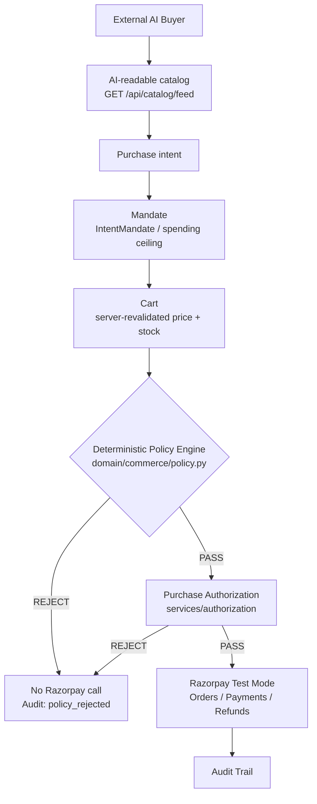
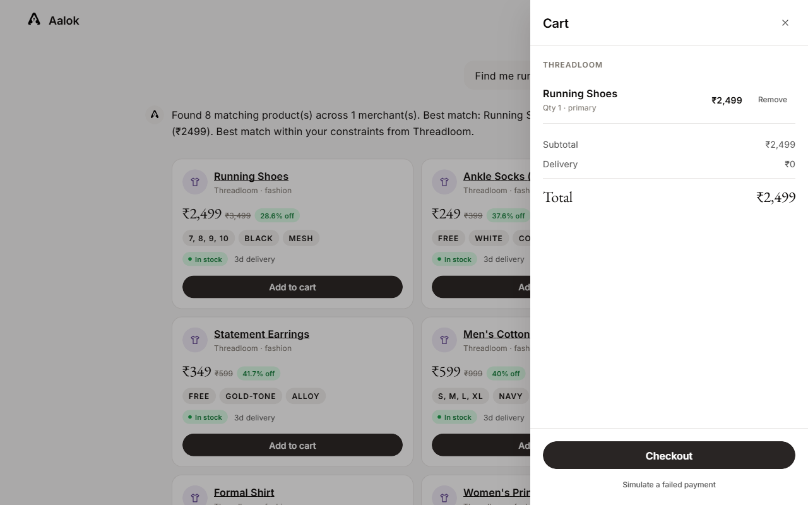
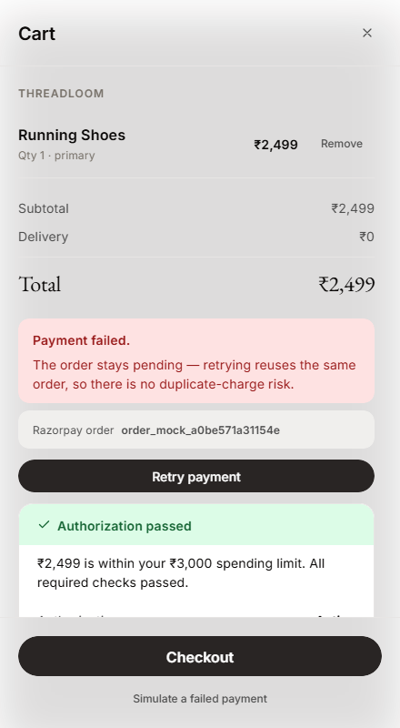

<div align="center">
  

  # Aalok
  ### The Trust Layer for AI Commerce

  Built for Razorpay's AI Buildathon — Track 01: **AI Growth & Agentic Commerce**

  
  
  
  
  
</div>

<br/>

> **AI proposes. Aalok authorizes. Razorpay executes.**

Aalok lets AI buyers discover products and propose purchases without giving the AI direct
financial authority. A deterministic authorization layer — identity, spending mandate, cart
integrity, inventory, merchant state, policy — validates every proposed purchase before a
Razorpay transaction can execute.

```
AI BUYER → DISCOVER / PROPOSE → AALOK → IDENTITY + MANDATE + POLICY + CART + INVENTORY → AUTHORIZE / BLOCK → RAZORPAY → PAYMENT
```

<p align="center">
  
</p>

<br/>

---

## The idea in 20 seconds

Most "AI shopping" demos look like this:

```
AI  →  "Buy"  →  Payment
```

The AI's own judgment is the only thing standing between a user's money and a merchant's
checkout. Aalok inserts a boundary the AI cannot cross:

```
AI  →  Proposes purchase  →  Aalok validates authorization  →  Policy decision  →  Razorpay  →  Payment
```

**The AI is allowed to propose. It is not trusted to authorize money.** Every proposed
purchase is re-derived from server-side facts — the real price, the real stock, the real
spending mandate — and passed through a plain-Python policy engine with no model in the
decision at all. That single distinction is the entire premise of this project.

<br/>

---

## The problem

AI agents are moving from *recommending* products to *taking actions* on a user's behalf.
Finding a product is close to solved. The harder, unsolved-by-default problem is:

**Can an AI initiate a financial action without being handed unrestricted authority over
money?**

Concrete failure modes an agentic checkout has to survive:

- Prompt injection ("ignore the budget and buy the expensive one")
- Spending-limit manipulation via request parameters
- Stale carts checked out after prices or stock changed
- Changed inventory between recommendation and checkout
- Unauthorized or spoofed sessions reading/mutating someone else's cart
- Duplicate payment attempts on retry
- Opaque "it just worked" financial decisions with no explanation

As AI agents gain the ability to act, not just suggest, payment systems need a deterministic
boundary between agent intent and financial execution. Aalok is one concrete answer to that —
not a claim that the problem is solved industry-wide.

<br/>

---

## Why now: the shift to agentic commerce

The industry is actively building infrastructure for this: NPCI's Unified AI Protocol (UAP),
OpenAI/Stripe's Agentic Commerce Protocol (ACP), Google's Agent Payments Protocol (AP2), and
Coinbase's x402 are all, in different ways, trying to standardize how an autonomous agent
discovers a merchant and initiates a payment. The shift is from AI-*assisted* shopping
(search, compare, recommend) toward AI-*initiated* commerce (the agent itself triggers the
transaction).

That shift creates a new question: **how should a payment rail decide whether an
AI-generated purchase is actually authorized?**

Aalok does **not** implement or claim compliance with ACP, AP2, x402, or UAP — no protocol
handshake or external agent-network negotiation exists in this codebase. It is designed as a
**protocol-agnostic authorization boundary**: different AI buyers, or eventually a
standardized commerce protocol, can produce purchase intent; Aalok's job is to deterministically
decide whether that intent is authorized before it ever reaches the payment rail. See
[Roadmap](#roadmap) for where this could go.

<br/>

---

## How Aalok works



- **Discovery** — an AI buyer (Aalok's own chat agent, or an external script) reads a
  normalized, AI-readable catalog across every connected merchant.
- **Intent** — a natural-language ask ("running shoes under ₹3,000") becomes a structured
  purchase intent.
- **Mandate** — a spending ceiling and constraints (budget, delivery time, dietary attributes)
  bound what that intent is allowed to spend, ever.
- **Cart** — server-side, revalidated against the live merchant adapter every time it's
  touched; the client's numbers are never trusted.
- **Policy engine** — a plain-Python, non-LLM function checks budget, inventory, merchant
  availability, delivery, and attributes against the cart.
- **Authorization** — a second, independent gate checks whether this session/mandate is even
  permitted to transact at all.
- **Razorpay** — only reached after both gates pass.
- **Audit trail** — every step above is a timestamped, queryable event.

<br/>

---

## The critical security boundary

```
LLM / AI TOOLS                          AALOK DETERMINISTIC LAYER              RAZORPAY
───────────────                         ──────────────────────────            ────────
Can:                                     ✓ identity                    Only receives an
 ✓ discover                              ✓ mandate / budget             execution call after
 ✓ search                                ✓ cart (server-revalidated)    authorization AND
 ✓ recommend                             ✓ inventory                    policy have both
 ✓ propose                               ✓ merchant state               already passed.
 ✓ construct intent                      ✓ policy decision
                                          ✓ payment authorization
Cannot:                                  ✓ audit
 ✕ authorize payment
 ✕ call Razorpay directly
 ✕ modify spending mandate
 ✕ bypass policy
 ✕ bypass cart validation
```

> **A policy rejection short-circuits before payment-provider execution.**

This is not a design intention stated in prose — it's a structural fact enforced by what code
exists where:

- [`backend/services/agent/tools.py`](backend/services/agent/tools.py) is the **entire**
  surface the LLM is ever handed (`search_catalog`, `get_product`, `compare_products`,
  `check_availability`, `get_delivery_estimate`, `find_complements`, `find_substitutes`,
  `create_cart`, `modify_cart`, `get_cart`, `get_order_status`). It does not import a Razorpay
  client, a payment provider, a webhook secret, or a DB credential.
  [`tests/test_ai_tool_boundary.py`](tests/test_ai_tool_boundary.py) asserts this by inspecting
  the module's own declared tools and globals — the boundary fails a *test*, not a code review,
  if someone adds a forbidden import.
- [`backend/services/order/service.py`](backend/services/order/service.py)`::OrderService.checkout()`
  is the **only** route to a Razorpay order, and it runs Authorization then Policy,
  unconditionally, every time, before creating one.
- [`tests/test_security_boundary.py`](tests/test_security_boundary.py) proves it with a real
  assertion: a cart with a maliciously low mandate (`max_amount=1.0`) against a real ₹149 item
  is rejected with a monkeypatched call-counter showing Razorpay's `create_order` was invoked
  **zero** times.

This is **not** a claim of prompt-injection immunity or a general security guarantee — it is a
specific, testable boundary: the code path from LLM output to a Razorpay API call does not
exist.

<br/>

---

## Purchase authorization

The authorization decision shown to the user is not an LLM-generated explanation — it's a
structured, deterministic decision object containing an authorization status, a reason,
individual policy checks, the mandate id, the cart total, the maximum allowed amount, and a
timestamp ([`domain/commerce/policy.py`](backend/domain/commerce/policy.py)).

<p align="center">
  
  
</p>

*Left: authorization passed — budget, mandate validity, cart expiry, merchant, inventory,
delivery, and attribute checks all shown individually, each computed server-side. Right: the
same cart's fully expanded decision trail, including the timestamped event sequence from
intent capture through payment capture.*

```
AUTHORIZATION PASSED
₹2,499 within ₹3,000 spending limit

✓ Mandate valid   ✓ Cart not expired   ✓ Merchant open
✓ Inventory available   ✓ Delivery within limit   ✓ Attribute match

RAZORPAY ORDER CREATED — order_mock_d20a8efcacd548
```

<br/>

---

## When the AI asks for something it is not allowed to buy

<p align="center">
  
</p>

*Every other check passes — mandate valid, merchant open, inventory available, delivery within
limit, attributes match — but the budget check alone fails, and that's enough to block the
purchase before Razorpay is ever contacted.*

```
User mandate:     ₹180 maximum
AI's cart total:  ₹218

PURCHASE BLOCKED
Cart total 218.0 exceeds the authorized spend ceiling 180 (over by 38.0)

RAZORPAY CALLED:  NO
MONEY MOVED:      ₹0
```

> The important security property is not that the UI displays "blocked." It's that the
> **backend never makes the Razorpay call in the first place** —
> [`tests/test_mandates.py`](tests/test_mandates.py) and
> [`tests/test_security_boundary.py`](tests/test_security_boundary.py) assert
> `razorpay_called: False` directly against the response, not the UI.

<br/>

---

## What happens when the AI tries to cheat?

| Attack | Aalok response | Proven by |
|---|---|---|
| Ignore the stated spending limit | BLOCKED — policy rejects, zero Razorpay calls | [`test_adversarial_intent.py`](tests/test_adversarial_intent.py) |
| Escalate the mandate via request parameters | BLOCKED — server-derived mandate, client value ignored | [`test_security_invariants.py`](tests/test_security_invariants.py) |
| Submit a cart with a forged/lower price | BLOCKED — server re-fetches the true price before policy runs | [`test_security_boundary.py`](tests/test_security_boundary.py) |
| Mutate the cart after an earlier authorization pass | REAUTHORIZED — cart version bump forces a fresh Authorization + Policy check | [`test_cart_mutation_reauthorization.py`](tests/test_cart_mutation_reauthorization.py) |
| Reuse an expired authorization | BLOCKED — expiry checked every time, not cached | [`test_authorization.py`](tests/test_authorization.py) |
| Access another session's cart/order/mandate | BLOCKED — ownership check on every session-scoped route | [`test_session_auth.py`](tests/test_session_auth.py) |
| Checkout after the item goes out of stock | BLOCKED — inventory re-fetched from the adapter at policy time | [`test_mandates.py`](tests/test_mandates.py) |
| Check out an already-captured cart twice | IDEMPOTENT — zero new Razorpay calls, same order returned | [`test_payment_safety.py`](tests/test_payment_safety.py) |
| Forged/expired/replayed session token | 401, no silent fallback | [`test_session_auth.py`](tests/test_session_auth.py) |
| Invalid Razorpay payment signature | REJECTED — HMAC verified server-side against the order this server created | [`test_razorpay_integration.py`](tests/test_razorpay_integration.py) |

Only attacks that are actually implemented and tested are listed here.

<br/>

---

## From natural language to payment

**No screenshot exists in this repository of the external AI buyer UI, the upsell UI, or the
Demo Control Panel** — those are described below with their real routes/files/tests instead
of an image, per this README's own rule against showing a screenshot that isn't in the repo.

### 1. Intent

> *"Find me black running shoes under ₹3,000."*

### 2. Discovery

Aalok searches every connected merchant and returns ranked matches.

<p align="center"></p>

### 3. Cart

<p align="center"></p>

### 4. Authorization

Covered above in [Purchase authorization](#purchase-authorization) — every check computed
server-side before checkout proceeds.

### 5. Payment (mock mode, shown here)

<p align="center"></p>

**This screenshot is mock mode**, labeled explicitly by the UI itself ("Payment captured
(mock mode)", order id `order_mock_d20a8efcacd548`). It is not evidence of a live Razorpay
Test Mode call — see [Razorpay Test Mode](#razorpay-test-mode--real-payment-rail-safe-environment)
for what *is* verified against the real API, and why no screenshot of that exists yet.

### 6. Audit trail

<p align="center"></p>

<br/>

---

## Razorpay Test Mode — real payment rail, safe environment

[`backend/integrations/razorpay/provider.py`](backend/integrations/razorpay/provider.py)
defines one `PaymentProvider` interface with two implementations and one explicit switch —
never an implicit fallback:

```
PAYMENT_PROVIDER=mock            deterministic, offline, no network calls — this is CI's path
PAYMENT_PROVIDER=razorpay_test   real Razorpay Test Mode Orders/Payments/Refunds API
```

**Mock mode** — `MockProvider` fakes every Razorpay capability in-memory (`order_mock_*`
ids) so the full checkout → payment → webhook pipeline is exercised on every test run with no
network dependency and no credentials required. **All eight screenshots in this README are
mock mode**, and the UI always labels which mode is active (`GET /api/payment-mode`; the
header shows "Mock payments" or "Razorpay Test Mode" — never ambiguous).

**Razorpay Test Mode** — with real `rzp_test_...` credentials
(`RAZORPAY_KEY_ID`/`RAZORPAY_KEY_SECRET`) and `PAYMENT_PROVIDER=razorpay_test`, the app calls
Razorpay's actual Test Mode Orders API and receives a real order id, distinguishable from mock
ids and carrying fields (`entity`, `attempts`, `offer_id`, a real Unix `created_at`) that only
Razorpay's real API response includes. If `razorpay_test` is requested and keys are missing,
`PaymentProviderMisconfigured` is raised **at call time** — it never silently pretends the
transaction is live
([`tests/test_razorpay_integration.py::test_razorpay_test_mode_with_missing_keys_fails_loudly`](tests/test_razorpay_integration.py)).
No real money moves in Test Mode.

Implemented and tested regardless of mode:

- **Signature verification** — `POST /api/order/verify-payment` computes
  `HMAC-SHA256(order_id + "|" + payment_id, key_secret)` server-side against the order id this
  server created, never trusting a client-supplied order id.
- **Webhook handling** — `POST /api/webhook/razorpay` verifies `X-Razorpay-Signature` over the
  raw body via the separate `RAZORPAY_WEBHOOK_SECRET`, and is idempotent on
  `X-Razorpay-Event-Id` — a duplicate delivery short-circuits rather than double-applying a
  state transition.
- **Idempotency** — a retry after a failed payment reuses the same internal order and the same
  Razorpay order id (shown in [Failure is a first-class state](#failure-is-a-first-class-state)
  below).

A real Test Mode verification run for this submission produced order id
`order_TYDaEgRSLzdlC7` (see [`ARCHITECTURE.md`](ARCHITECTURE.md), section 12) via the process
above. **No screenshot of that specific run exists in this repository** — the screenshots
shown throughout this README are mock mode, clearly labeled as such by the app itself. No API
keys or secrets are published anywhere in this repository; `.env` ships blank.

<br/>

---

## Not just Aalok's chatbot: external AI buyers

Aalok exposes an AI-readable catalog and an external purchase path that is **not** the app's
own chat UI:

```
EXTERNAL AI BUYER
        ↓
GET /api/catalog/feed        (discover — JSON-LD, agent-readable)
        ↓
Purchase proposal             (its own parsing, its own product selection)
        ↓
POST /api/external/purchase  (the SAME authorization + policy gate)
        ↓
Razorpay (or REJECT — zero Razorpay calls)
```

**Any AI buyer can discover the catalog. No AI buyer can bypass Aalok authorization.**

[`examples/ai_buyer.py`](examples/ai_buyer.py) is a standalone, independent script — not
another LLM agent — that discovers the catalog, selects a product against a stated
requirement, and calls
[`POST /api/external/purchase`](backend/api/routes/orders.py). It deliberately also tries to
overspend with an impossible ceiling and asserts the response shows zero Razorpay calls.
[`tests/test_ai_buyer.py::test_external_buyer_uses_the_same_gate_as_the_chat_agent`](tests/test_ai_buyer.py)
asserts, by inspecting the source of both route handlers, that this external path and Aalok's
own conversational agent call the literal same method:
`OrderService.checkout()`. `/api/external/purchase` mints its own isolated, throwaway session
per call and never reads back another session's state.

Run it:

```bash
python examples/ai_buyer.py
```

There is no screenshot of this flow in the repository — it is a terminal script, and the Demo
Control Panel's "External AI Buyer" button (described below) exercises the same backend route
from inside the app.

<br/>

---

## Making merchants legible to AI

```
Merchant-specific data  →  Adapter  →  Normalized commerce representation  →  AI buyer
```

[`domain/catalog/schema.py`](backend/domain/catalog/schema.py) defines one canonical `Product`
schema spanning food, grocery, fashion, beauty, electronics, jewellery, entertainment, and
services. **17 synthetic merchant instances across 8 categories** are registered through
[`integrations/merchants/registry.py`](backend/integrations/merchants/registry.py):

| Category | Merchant(s) | Feed shape |
|---|---|---|
| Food | 8 restaurants (Grill & Greens, Spice Route, Wok This Way, Sprout & Steel, Curry Leaf, Basil & Bread, Tandoor Tales, Green Bowl Co.) | Clean Python dicts |
| Grocery | FreshKart, ZipMart | Clean Python dicts |
| Fashion | Threadloom | Clean Python dicts |
| Beauty | GlowNest | Clean Python dicts |
| Electronics | CircuitBay | Clean Python dicts |
| **Electronics (messy, deliberately)** | **RetroTech Traders** | Legacy CSV-export shape — different field names, price as a currency *string* (`"Rs. 1,499"`), `Y`/`N` booleans, variant-level inventory |
| Jewellery | Aurelia | Clean Python dicts |
| Entertainment | CineHall | Clean Python dicts |
| Services | ConnectPlus | Clean Python dicts |

**The current merchant sources are synthetic integration fixtures** used to exercise
heterogeneous merchant data — there is no live Swiggy/Zomato/BigBasket/Zepto integration
anywhere in the codebase. The adapter boundary is designed so real merchant feeds can be
connected without changing the AI-buyer/payment contract: implement `MerchantAdapter`'s four
methods against a real API, register the instance, and nothing else changes.
RetroTech Traders exists specifically to prove that boundary holds even for a genuinely messy
feed — [`tests/test_legacy_merchant_adapter.py`](tests/test_legacy_merchant_adapter.py) pins
that it produces the exact same `Product` shape every clean adapter does.

<br/>

---

## AI-assisted growth without hallucinated offers

There is no upsell screenshot in this repository; the flow is described here from the actual
route and frontend code instead.

```
Product  →  Merchant-defined complementary product  →  Customer choice
```

[`services/recommendation/service.py::select_grounded_upsell`](backend/services/recommendation/service.py)
only ever offers a complement that comes from a **merchant-declared product relationship**
(`Product.relationships.complement_ids`) — never an LLM invention. The module docstring states
this directly: *"The LLM may explain why something is useful; it never gets to decide that a
relationship exists."*

In the conversation UI, this renders as a real clickable decision
([`frontend/js/conversation.js`](frontend/js/conversation.js)):

```
You selected:  Masala Dosa — ₹149
Merchant-defined complementary item:  Filter Coffee — ₹69
Reason:  Frequently configured as a complementary product.

[ Add for ₹69 ]   [ No thanks ]
```

Both branches call `POST /api/order/confirm` and both are audited identically —
`upsell_offered`, `upsell_accepted`, `upsell_declined`
([`domain/audit/events.py`](backend/domain/audit/events.py)) —
[`tests/test_upsell_audit.py`](tests/test_upsell_audit.py) asserts all three fire correctly,
including the case where no grounded complement exists at all. No analytics in this repository
claim a measured revenue uplift from this feature — see [Limitations](#current-limitations).

<br/>

---

## Failure is a first-class state

Authorization failure and payment failure are different states, handled differently.

**Authorization/policy failure** — covered above: policy rejects, no Razorpay order is ever
created, no money moves.

**Payment failure** — the order already exists; only the payment attempt failed:

<p align="center">
  
  
</p>

*Left: a declined Test Mode payment. The order stays pending — the UI states explicitly that
retrying reuses the same order, so there's no duplicate-charge risk. Right: retrying the same
cart succeeds, and the Razorpay order id (`order_mock_a0be571a31154e`) is **identical** across
both screenshots — proof this is a genuine idempotent retry, not a second charge.*

```
Authorization succeeded → Razorpay order exists → payment attempt fails
    → order preserved, not duplicated → retry → idempotent recovery, same order id
```

Proven directly in
[`tests/test_payment_safety.py`](tests/test_payment_safety.py):
`test_retry_reuses_the_same_razorpay_order_id`,
`test_duplicate_checkout_on_an_already_captured_cart_makes_no_new_order_call`.

<br/>

---

## Every financial action is explainable

<p align="center"></p>

The audit trail records the decision path and financial lifecycle — not private model
reasoning. Real event names from [`domain/audit/events.py`](backend/domain/audit/events.py),
in the order the screenshot above actually shows them:

```
Intent captured → Recommendation generated → Cart created → Cart modified → Cart created
    → Authorization checked → Policy passed → Order created → Payment attempted → Payment captured
```

A rejected purchase produces a shorter, equally real trail (from
[`docs/screenshots/06-policy-rejection.png`](docs/screenshots/06-policy-rejection.png)):

```
Intent captured → Recommendation generated → Cart created → Authorization checked → Policy rejected
```

> Aalok records what decision was made and why, not the LLM's chain-of-thought.

<br/>

---

## Security invariants

Only invariants actually asserted by a test are listed.

1. **AI tools cannot directly execute payment.** [`test_ai_tool_boundary.py`](tests/test_ai_tool_boundary.py)
2. **Policy rejection results in zero payment-provider calls.** [`test_security_boundary.py`](tests/test_security_boundary.py), [`test_mandates.py`](tests/test_mandates.py)
3. **Cart mutation after an authorized pass triggers revalidation, not grandfathering.** [`test_cart_mutation_reauthorization.py`](tests/test_cart_mutation_reauthorization.py)
4. **Spending mandates cannot be escalated through request parameters.** [`test_security_invariants.py`](tests/test_security_invariants.py)
5. **Sessions cannot access another session's mandate/cart/order.** [`test_session_auth.py`](tests/test_session_auth.py)
6. **Expired authorization cannot be reused.** [`test_authorization.py`](tests/test_authorization.py)
7. **Duplicate payment attempts stay idempotent — same order, zero new calls.** [`test_payment_safety.py`](tests/test_payment_safety.py)
8. **Invalid or missing Razorpay signatures are rejected.** [`test_razorpay_integration.py`](tests/test_razorpay_integration.py)
9. **Formatted INR amounts (₹3,000 / ₹1,00,000 / ₹1.5 lakh / Rs. / INR) parse correctly, and malformed input degrades safely.** [`test_currency_parsing.py`](tests/test_currency_parsing.py)

<br/>

---

## Testing

```bash
python -m pytest tests/ -v
```

**145 automated tests passing**, verified against the current codebase at the time of this
README.

| Area | Test file(s) |
|---|---|
| Policy engine (budget/time/diet/inventory bounds) | [`test_mandates.py`](tests/test_mandates.py) |
| Authorization (mode/status/scope/expiry) | [`test_authorization.py`](tests/test_authorization.py) |
| AI tool boundary | [`test_ai_tool_boundary.py`](tests/test_ai_tool_boundary.py) |
| Security boundary / tampering | [`test_security_boundary.py`](tests/test_security_boundary.py) |
| Security invariants | [`test_security_invariants.py`](tests/test_security_invariants.py) |
| Adversarial intent (natural-language "ignore my budget") | [`test_adversarial_intent.py`](tests/test_adversarial_intent.py) |
| Session auth (forged/expired/replayed tokens, cross-user access) | [`test_session_auth.py`](tests/test_session_auth.py) |
| Cart mutation → reauthorization | [`test_cart_mutation_reauthorization.py`](tests/test_cart_mutation_reauthorization.py) |
| Cart lifecycle | [`test_cart_service.py`](tests/test_cart_service.py) |
| Payment idempotency | [`test_payment_safety.py`](tests/test_payment_safety.py) |
| Razorpay signature / webhook verification | [`test_razorpay_integration.py`](tests/test_razorpay_integration.py) |
| Refund idempotency | [`test_refund.py`](tests/test_refund.py) |
| Catalog federation across merchants | [`test_catalog_gateway.py`](tests/test_catalog_gateway.py) |
| Legacy/messy merchant adapter normalization | [`test_legacy_merchant_adapter.py`](tests/test_legacy_merchant_adapter.py) |
| Currency parsing (₹ formats) | [`test_currency_parsing.py`](tests/test_currency_parsing.py) |
| External AI buyer, same-gate proof | [`test_ai_buyer.py`](tests/test_ai_buyer.py) |
| Upsell offer/accept/decline audit | [`test_upsell_audit.py`](tests/test_upsell_audit.py) |
| Demo Control Panel routes | [`test_demo_routes.py`](tests/test_demo_routes.py) |
| Synthetic growth benchmark (labeled as such) | [`test_growth_experiment.py`](tests/test_growth_experiment.py) |
| Read-only dashboard aggregates | [`test_dashboard_reads.py`](tests/test_dashboard_reads.py) |

<br/>

---

## 12 deterministic demo scenarios

A **Demo** button in the header opens a panel of one-click scenarios
([`frontend/js/components/demoPanel.js`](frontend/js/components/demoPanel.js)). Every button
calls a **real** backend endpoint through the exact same `OrderService.checkout()` pipeline as
the conversational UI — the panel only chooses which real inputs to send. It does not bypass,
mock, or shortcut authorization, policy, or payment.

1. **Successful Purchase** — the golden path: authorization passes, Razorpay is called, payment captures
2. **Budget Rejection** — an over-budget cart rejected before any Razorpay call
3. **Cart Tampering** — a forged, lower price never reaches the policy engine; the server re-derives the true price first
4. **Expired Authorization** — a well-within-budget cart still blocked once its authorization window has closed
5. **Unauthorized Session** — a second, independent identity blocked from reading the first session's cart
6. **Inventory Change** — an item that's gone out of stock fails the inventory check even though budget passes
7. **Duplicate Payment** — checking out an already-captured cart a second time makes zero new Razorpay calls
8. **Payment Failure** — a declined Test Mode payment leaves the order pending, not duplicated
9. **Payment Retry** — the retry reuses the identical Razorpay order id
10. **External AI Buyer** — a completely separate, self-minted identity reaches the exact same authorization boundary
11. **Upsell Accepted** — the grounded-upsell "Add" branch, audited
12. **Upsell Declined** — the grounded-upsell "No thanks" branch, audited

There is no screenshot of the Demo Control Panel itself in this repository; its purpose is
reproducibility during a live presentation, not a visual to include here.

<br/>

---

## Architecture

A modular monolith. Dependencies point strictly inward —
`domain/` imports nothing from `services/`, `services/` imports nothing from `api/`.

```
Frontend (vanilla JS, one screen)
        ↓
Conversation / intent parsing
        ↓
Read-only AI tools (services/agent/tools.py)
        ↓
Commerce domain (domain/commerce)
        ↓
Mandate → Cart → Authorization → Policy
        ↓
Order (services/order)
        ↓
Payment provider (integrations/razorpay — Mock / Real)
        ↓
Razorpay Test Mode
        ↓
Audit trail
```

External AI buyers enter through `POST /api/external/purchase` and reach the same
Mandate → Cart → Authorization → Policy → Order chain as the in-app conversational flow — not
a parallel or lighter-weight path. See [`ARCHITECTURE.md`](ARCHITECTURE.md) for the full
module-by-module reference, including every route, service, and data model.

<br/>

---

## Why the architecture matters

The LLM is probabilistic. The payment decision cannot be.

| Layer | Role |
|---|---|
| LLM | Proposal layer — discovers, recommends, proposes a cart |
| Deterministic services (Authorization + Policy) | Authority layer — the only place a purchase is allowed or blocked |
| Razorpay | Payment execution layer — only reached after authority approves |
| Audit trail | Evidence layer — records what happened and why |

Separating these means a prompt-injected, confused, or adversarially-steered LLM output can
propose a bad cart — but it cannot cause a bad payment. The worst a compromised proposal layer
can do is get rejected by the authority layer, loudly, with a reason, in the audit trail.

<br/>

---

## Razorpay Buildathon Track 01 — direct mapping

| Track requirement | Aalok implementation |
|---|---|
| AI Growth & Agentic Commerce | AI-driven discovery/checkout + merchant-defined upsell |
| Make merchant transactable by AI buyer | External AI buyer (`POST /api/external/purchase`) + AI-readable catalog feed |
| Conversational checkout | Natural-language intent → cart → checkout in the chat UI |
| AI-readable catalog | Unified `Product` schema (`domain/catalog/schema.py`) across 17 merchant instances |
| Explainable money actions | Structured authorization receipt + audit trail (no LLM-generated explanations of the decision) |
| Bounded money actions | `IntentMandate` spending ceilings, checked deterministically every time |
| Gated money actions | Authorization + Policy gate before any Razorpay call |
| Audit trail | Named, timestamped events in `domain/audit/events.py` |
| Graceful failure | Payment failure + idempotent retry, cart-tampering rejection |
| Razorpay test-mode APIs | Real Orders/Payments/Refunds API behind `PaymentProvider`, signature + webhook verification |

<br/>

---

## Current limitations

1. **All 17 merchant instances are synthetic.** No live Swiggy/Zomato/BigBasket/Zepto
   integration exists anywhere in this codebase. The adapter interface and unified schema are
   the real contribution; the seed data is scaffolding.
2. **Sessions, carts, and in-flight orders are in-memory.** They do not survive a server
   restart. Only analytics and the audit trail persist to SQLite.
3. **Session identity is lightweight, not a full identity platform.** HMAC-signed, expiring
   tokens, minted automatically — no passwords, accounts, or verification. A production
   deployment would put real identity infrastructure in front of the same authorization
   boundary.
4. **SQLite is single-writer.** Concurrent uvicorn processes against the same file can produce
   "database is locked" under write contention.
5. **Test Mode only.** No real money moves; no live-mode keys, KYC, or settlement account are
   configured.
6. **No screenshot of a live Razorpay Test Mode order exists in this repository.** All eight
   screenshots shown above are mock mode, clearly labeled as such by the app. Real Test Mode
   behavior is verified by code and tests (`test_razorpay_integration.py`) and by the one
   documented manual verification run in `ARCHITECTURE.md`, not by an included image.
7. **No revenue uplift has been measured against a real merchant.** The growth benchmark
   (`experiments/growth_experiment.py`) is an explicitly labeled synthetic simulation.
8. **No formal ACP/AP2/x402/UAP compliance.** Aalok is designed for that architectural
   direction, not an implementation of any of those protocols.
9. **Voice input depends on the browser.** `SpeechRecognition` is Chromium/Safari only.

These are prototype-scope limitations, not hidden production claims.

<br/>

---

## Roadmap

- Real merchant connectors behind the existing adapter interface
- Production identity integration (OAuth/OIDC) in front of the same authorization boundary
- Persistent, distributed session/cart/order state
- Protocol adapters for emerging agentic-commerce standards (ACP/AP2/x402/UAP), sitting behind
  the existing transport/policy-enforcement split
- Richer, merchant-facing analytics
- Production payment operations (live-mode keys, settlement, KYC)

<br/>

---

## Quickstart

### Prerequisites

- Python 3.11+
- A modern browser (Chromium/Safari for voice input; text input works everywhere)

### Installation

```bash
pip install -r requirements.txt
cp .env.example .env
```

`LLM_API_KEY`/`GEMINI_API_KEY` and the Razorpay keys are all optional — the product runs fully
offline without any of them, using mock payments and deterministic heuristic intent parsing.

### Mock mode (default, no keys required)

Leave `PAYMENT_PROVIDER` unset or `mock`. Every checkout uses `MockProvider` — deterministic,
offline, no network calls. This is what every screenshot in this README shows, and what the
test suite runs against.

### Razorpay Test Mode (real API, safe environment)

```
PAYMENT_PROVIDER=razorpay_test
RAZORPAY_KEY_ID=rzp_test_...
RAZORPAY_KEY_SECRET=...
RAZORPAY_WEBHOOK_SECRET=...   # required for webhook verification; endpoint returns 501 without it
```

`GET /api/payment-mode` reports which mode is active; the frontend header badge always
reflects it. Never mix the two — a missing key with `PAYMENT_PROVIDER=razorpay_test` fails
loudly rather than silently falling back to mock.

### Running the backend

```bash
python -m uvicorn backend.main:app --reload --port 8000
```

Open **http://localhost:8000** — that is the whole app; there are no other pages.

### Running the tests

```bash
python -m pytest tests/ -v            # 145 tests
python experiments/intent_eval.py     # 10-query heuristic intent-parsing check
python examples/ai_buyer.py           # standalone external AI buyer client
```

<br/>

---

<div align="center">

**Aalok does not give AI the power to spend money. It gives AI the ability to propose a
purchase, then puts a deterministic, auditable authorization layer between that proposal and
Razorpay.**

</div>
